# 3. Команда git reset (отмена изменений в GIT)

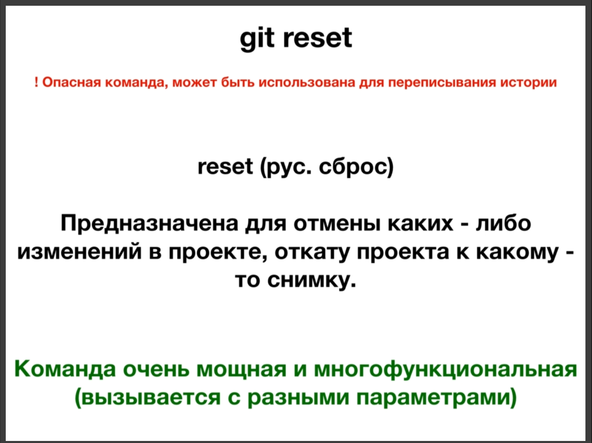

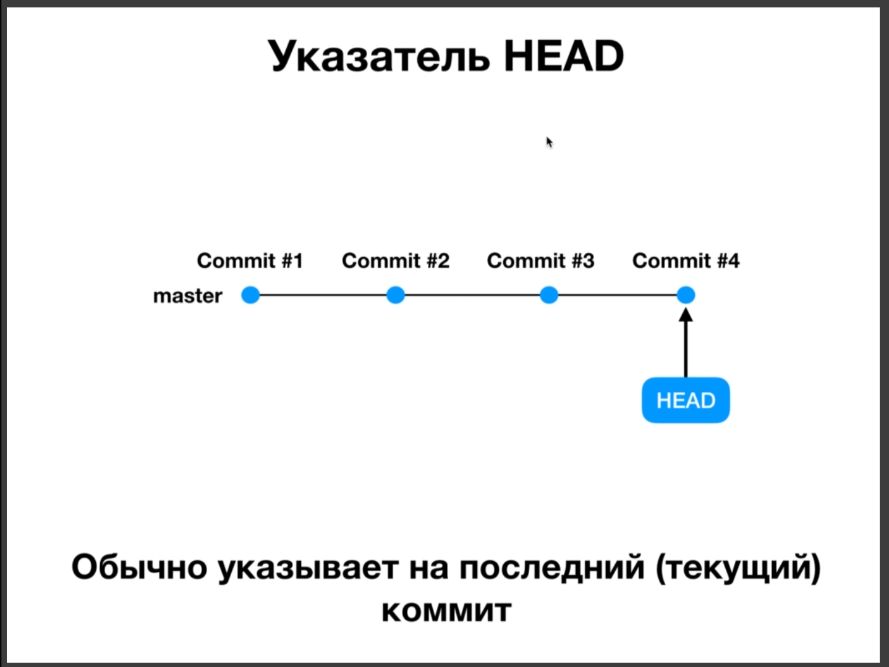

На слайде представлена ветка мастер. Все комиты по умолчанию, если мы их не делаем в определенной ветке, они попадают в ветку мастер.

Представлены наши снимки, коммиты. HEAD указывает на последний текущий коммит. HEAD показывает какая версия проекта сейчас актуальна т.е. то на что указывает HEAD это и есть текущее состояние нашего проекта. Этот указатель можно смещать. Если мы укажем **git reset HEAD^**

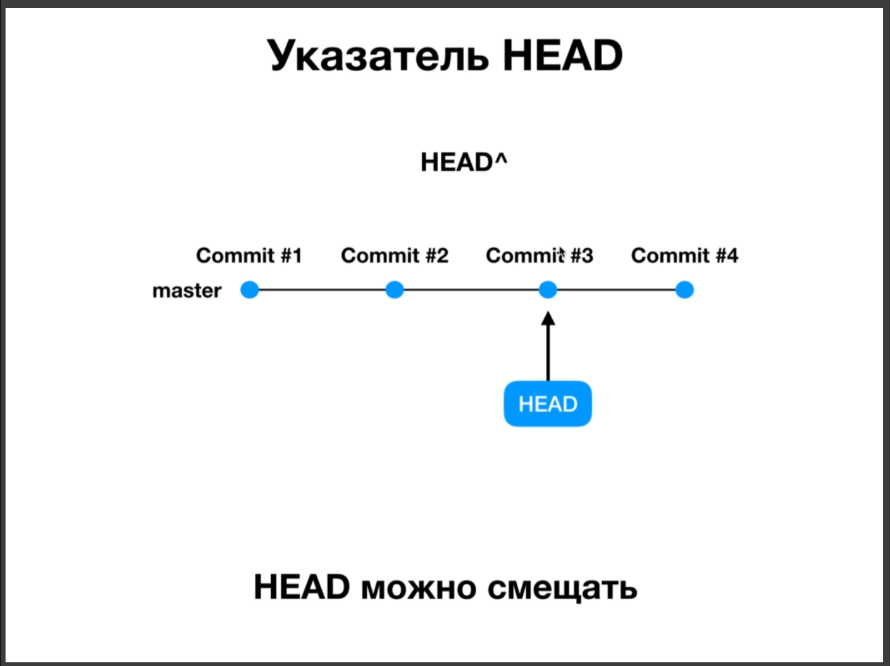

это значит что мы хотим сместиться на один коммит назад. Мы можем ставить **^** любое количество.

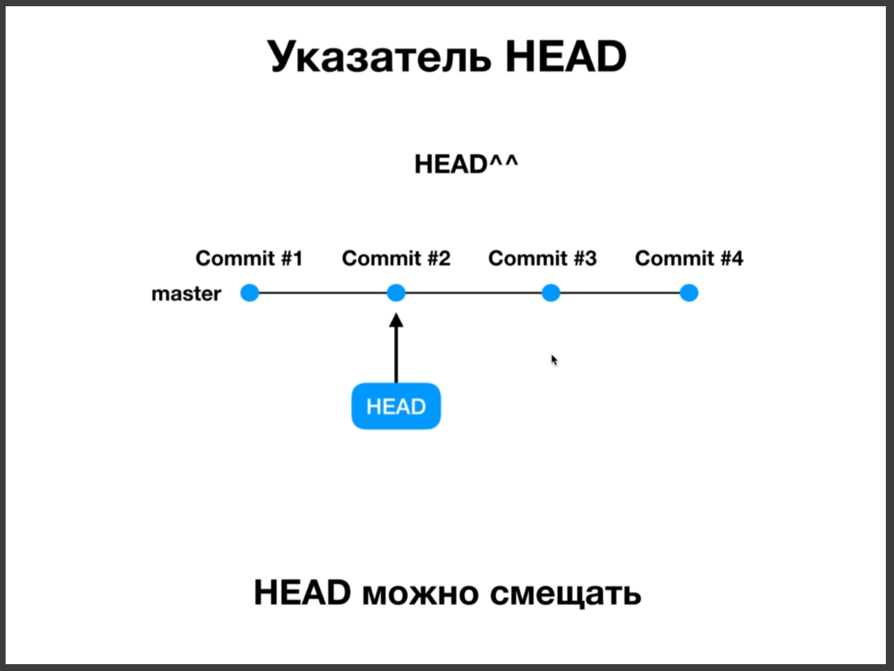

Мы можем таким образом смещать указатель HEAD на сколько угодно коммитов назад.

Так же помимо такого синтаксисамы можем использовать **HEAD~2**


Команда **git reset** имеет три режима (в зависимости от радикальности отката к указанному коммиту).

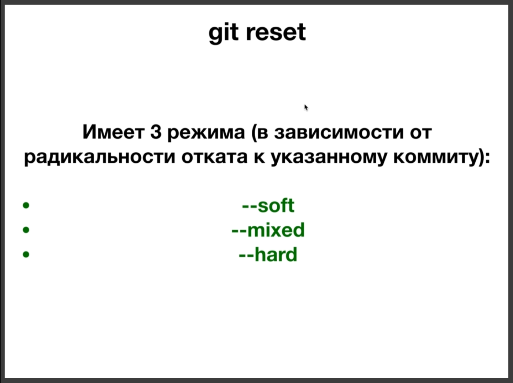

**--soft** самый мягкий и самый не радикальный.
**--mixed** который используется по умолчанию
**--hard** откат производится максимально радикально удаляются изменения и перезаписывается история. Самый опасный режим работы **git reset**.

Посмотрим на синтаксис.

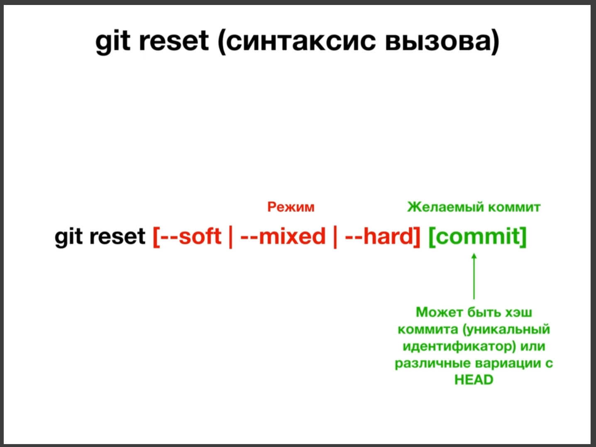

Пишем git reset, выбираем режим, и указываем коммит к которому мы хотим откатится. Вместо коммита у нас может быть хэш коммита т.е. уникальный индентификатор коммита или различные вариации с HEAD.

Начнем с самого жесткого режима **--hard**

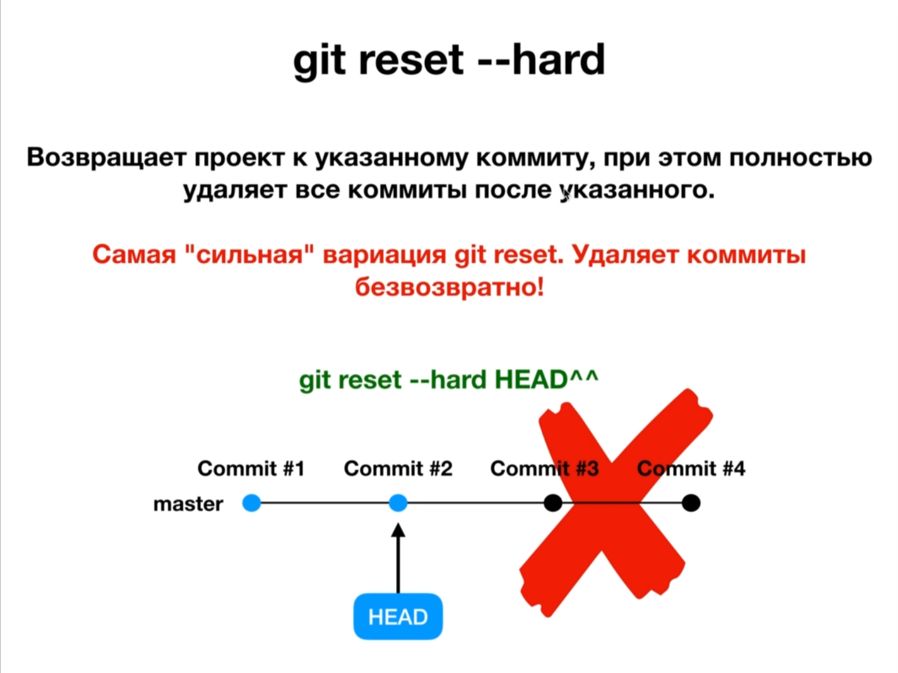

Этот вызов возвращает проект к указанному коммиту при этом удаляет все коммиты после указанного. Это самая сильная вариация **git reset** и она удаляет коммиты безвозратно. Поэтому это использовать довольно опасно.

В отличие от большинства использования сценариев гита здесь вы можете реально потерять какую-то информацию. **GIT** так устроен что в большинстве своих команд существует большая избыточность. Вы что-то делаете и чаще всего вы не теряете какую-то информацию, она остается в **git**.

На слайде указан пример как возвратится на два коммита назад.

Рассмотрим **git reset --mixed**.

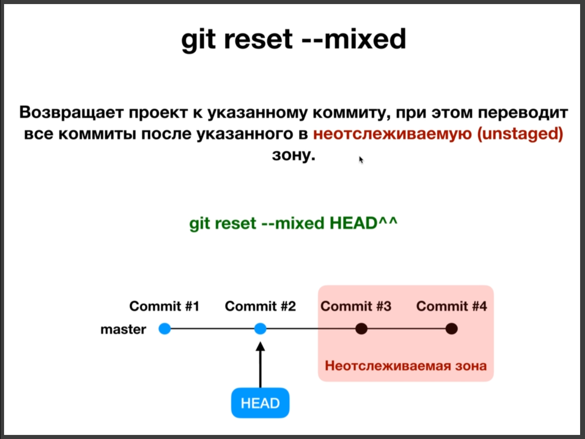

В отличие от режима **hard**, **--mixed** откатывается к указанному коммиту, а последующие за ним коммиты становятся не отслеживаемыми т.е. мы можем поправить какие-то ошибки и снова сделать снимок. Просто эти коммиты переводяться в не отслеживаемую зону. Сами коммиты удаляются из гита и переводяться в неотслеживаемую зону. Т.е. все изменения остаются, но теперь нам снова нужно сделать **git add** что бы перевести их в отслеживаемую зону и после сделать **git commit -m ""**.

И есть самая мягкая версия **git reset --soft**

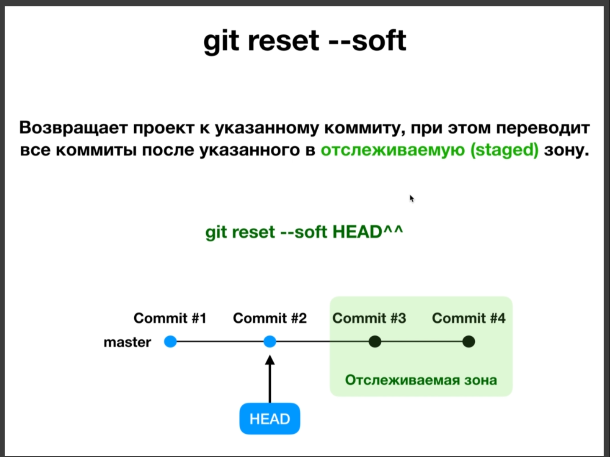

Делает откат к указанному коммиту с удалением последующих после него коммитов и переводом их в отслеживаемую зону.

Как я говорил можно и по хэшу коммита.

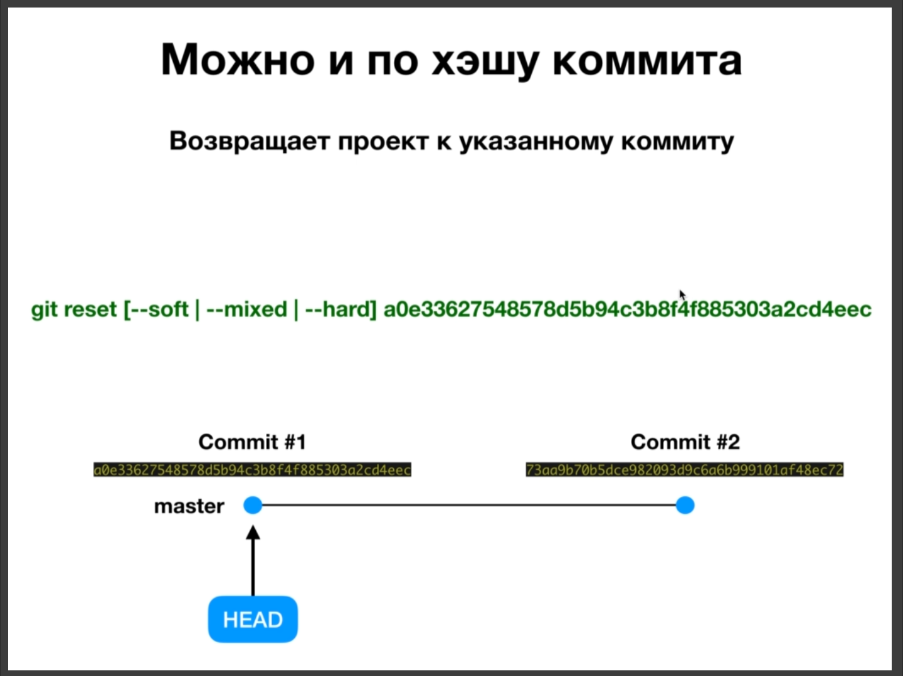

Так же я могу вызывать **git reset** не передавая ей какие-либо параметры.

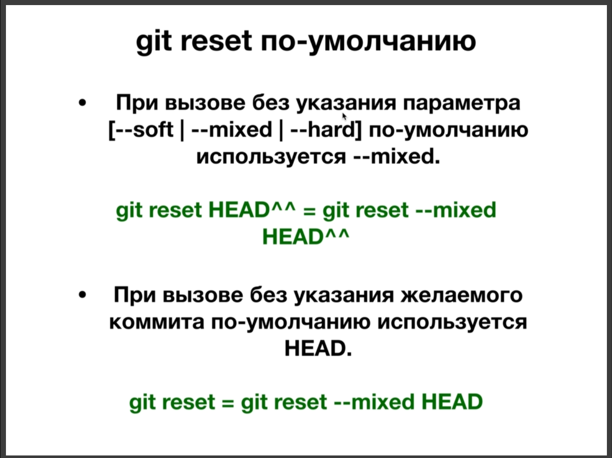

Практика.

Смотрю историю всех своих коммитов **git log**

```git
$ git log
commit 09fe85a368f4706b78afafd34d36293a0a422a09 (HEAD -> master)
Author: Konstantine899 <kostay375298918971@gmail.ru>
Date:   Wed Oct 21 13:13:28 2020 +0300

    add 003md

commit ce91bc5353400ee73799dd1c7cf27b34a873c32e
Author: Konstantine899 <kostay375298918971@gmail.ru>
Date:   Wed Oct 21 12:22:21 2020 +0300

    Change img and rename md

commit bbb93bae59817e5dfcd06ef2d1afd0a47bdd9a81
Author: Konstantine899 <kostay375298918971@gmail.ru>
Date:   Wed Oct 21 12:10:54 2020 +0300

    file rename001

commit 5388484ad1b71499f7f3ba8cd5d29d65fb2d0168
Author: Konstantine899 <kostay375298918971@gmail.ru>
Date:   Wed Oct 21 11:54:36 2020 +0300

    file edit001

commit 17f9e2615e3700c621295a1fbe292f0585b00c46 (origin/master)
Author: Konstantine899 <kostay375298918971@gmail.ru>
Date:   Wed Oct 21 00:09:54 2020 +0300
```

Вот текущая ветка и коммит в котором я нахожусь commit 09fe85a368f4706b78afafd34d36293a0a422a09 (HEAD -> master)

Если я введу git reset без параметров, то произойдет откат на один коммит. Сначало сделаю новый коммит.

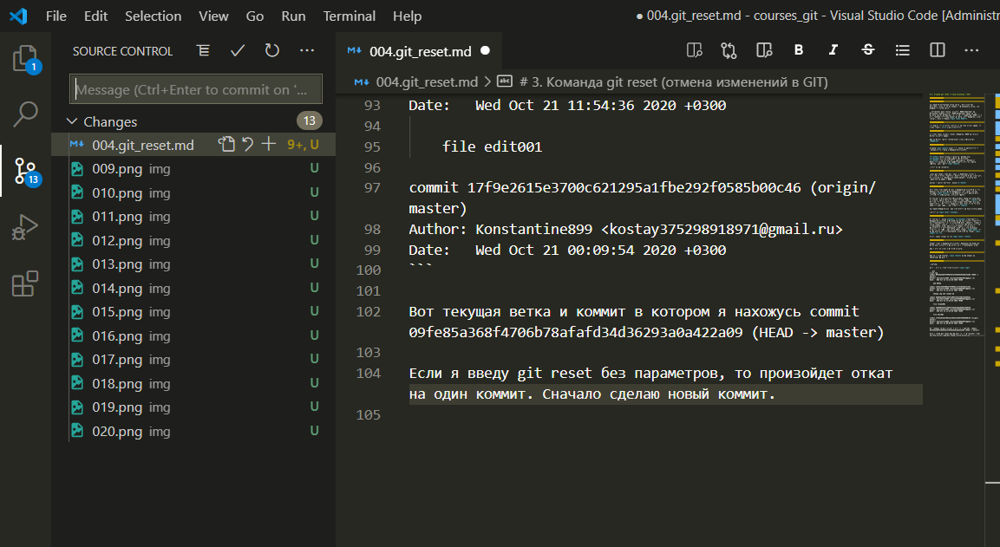

Добавляю для отслеживания все файлы в текущей дирректории **git add .**


Все таки текст тоже удалился т.к. произошел откат к коммиту. суть от этого не поменялась удаляет отслеживаемые изменения и не отслеживаемы что даже весь код в редакторе переходит в состояния последнего коммита. Смотри на скриншоты.

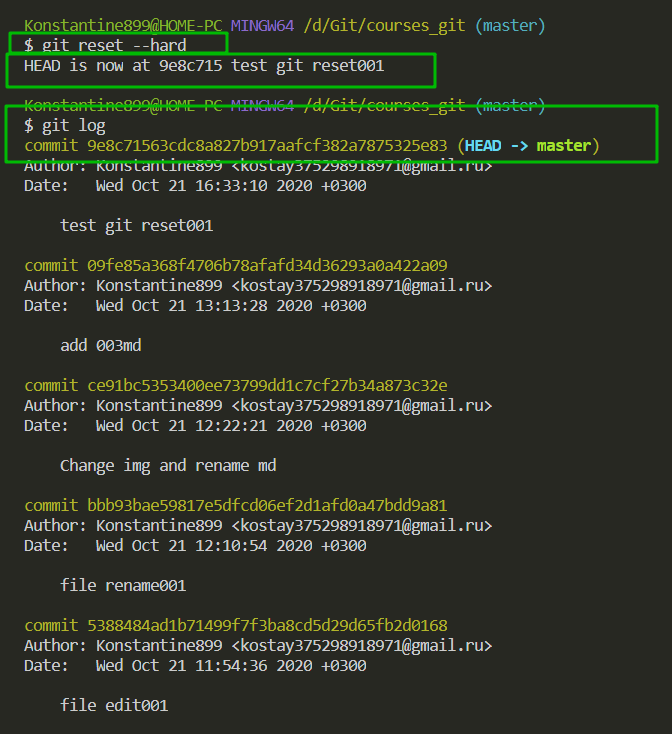

Не отслеживаемы файлы остались так как я походу делал скриншоты. Делаю **git add .** и **git commit -m "test git reset001"**. Далее пытаюсь откатится к другому коммиту и оставить файлы отслеживаемыми с помощью **--soft**. И так откатываюсь на два коммита назад **git reset --soft HEAD^^**

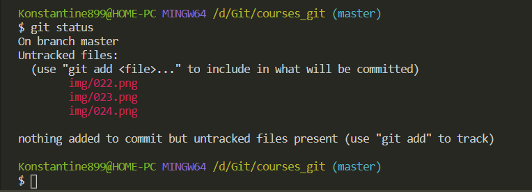

Делаю отслеживаемыми **git add .**

Таким образом мы не уходим далеко в прошлое. Мы лишь откатываемся к последнему коммиту.


Теперь попробуем пойти по дальше в прошлое т.е. не с последним коммитом, а с каким то коммитом в прошлом.

**Кстати запомните одну особенность git reset не удаляет не отслеживаемые файлы.**

Коммитов в этом репозитории много, но не хочу портить репозиторий. Дальше буду писать и объяснять на пальцах.

Делаю несколько воображаемых коммитов. Хотя с **--soft** попробую. **$ git reset --soft HEAD^^** откатываюсь на два коммита назад и смотрю.

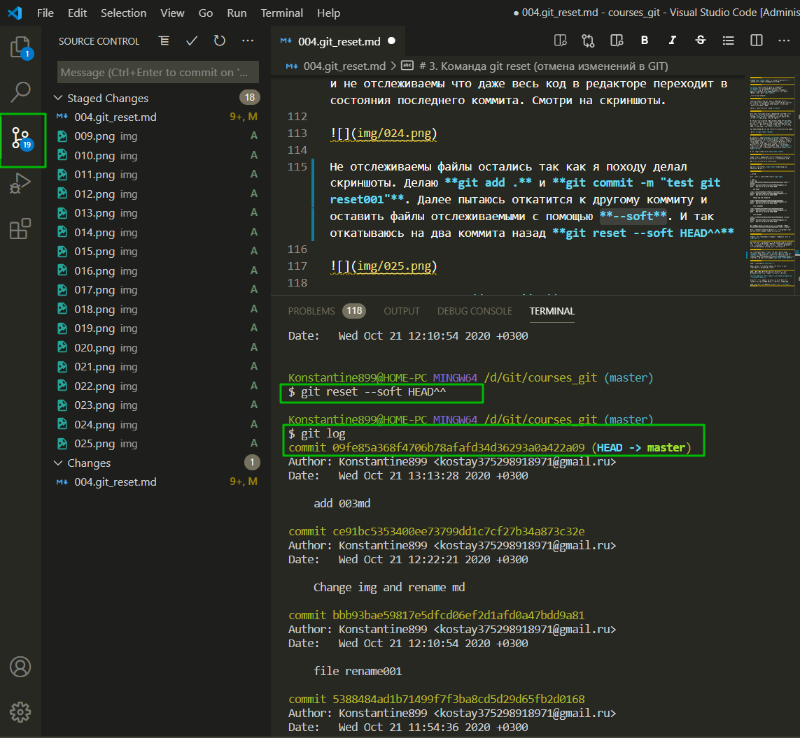

Откат произошел и файлы остались отслеживаемыми.

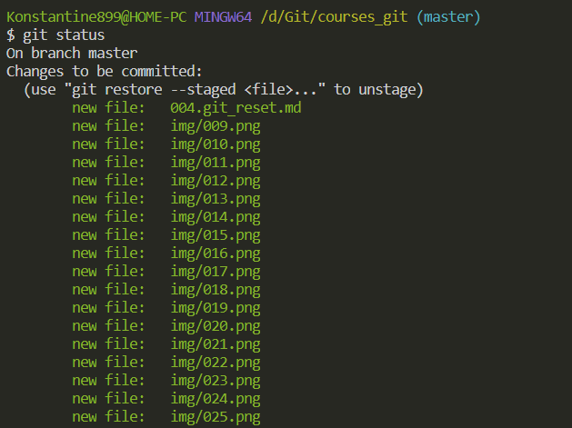

теперь я могу что-то поправить и внести новые изменения. Делаю коммит.

Однако для того что бы вернуть в то состояние которое было нужно наши изменения изменить из отслеживаемой зоны в неотслеживаемую. Для этого делаю git reset который с параметром --mixed по умолчанию Короче фигню он какую-то показал создал несколько файлов и закомител т.е. по факту это не возврат к предыдущему состоянию а продолжение коммитов от той точки к которой мы вернулись т.е. новые коммиты.

Далее могу попать по к коммиту по хешу. к примеру **git reset 09fe85a368f4706b78afafd34d36293a0a422a09**

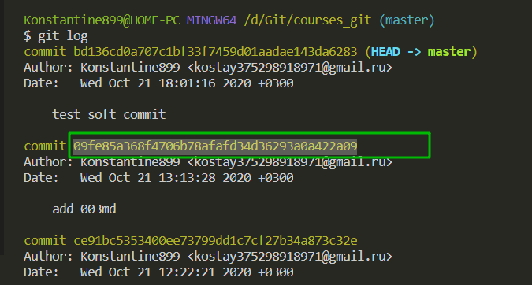

И данный комит к которому мы перешли переведен в неослеживаемую зону. Добавляю в отслеживаемую и делаю коммит.

C --hard все понятно удалит все коммиты после того коммита к которому мы сделали переход.

Еще одна вещь о которой нужно сказать что **git reset** это опасная команда и что вы никогда не должны делать git reset к какому нибудь коммиту, после того как вы опубликовали какие-либо коммиты.

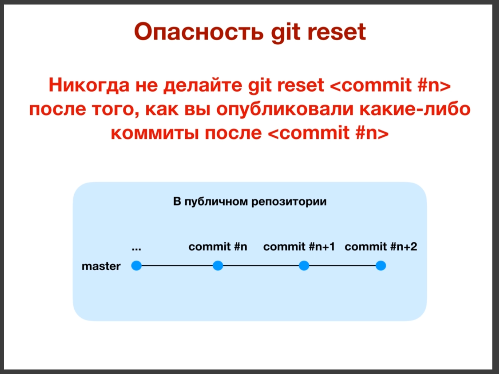

Если вы опубликовали свои файлы в публичном репозитории вы никогда не должны делать **git reset** т.к. ваши напарники с которыми вы работаете могут потерять актуальность своих наработок.

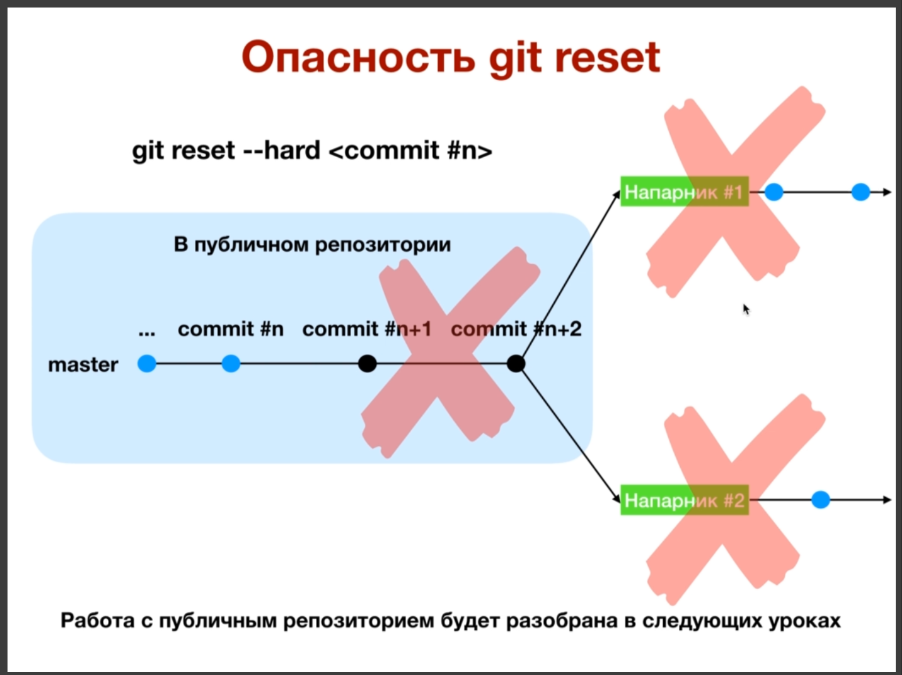

Таким образом получится что у всех членов команды разная версия репозитория.