# Branching (Ветвление)

В ветке мастер обычно хранится стабильная версия проекта, а вот в других ветках содержатся отдельные функции проекта. Это делается потому что мы не хотим какие-то не стабильные функции внедрять в нашу стабильную версию проекта.

Отдельные ветки не влияют на работоспособность главной ветки, не влияет на работоспособность главной стабильной версии.

Когда ответвленная ветка доходит до какого-то состояния т.е. до стабильной работоспособности, когда код стабилен, этот код, эту ветку можно слить в главную ветку. Теперь в главной ветке появляется та функция которая разрабатывалась в отдельной ветке. Т.е. это очень удобный способ распределения работы и обезопашивания главной ветки для стабильной работы.

После слияния может создаваться особый коммит или **commit merge** но это не всегда происходит. Разберем это позже.

Основные команды для работы с ветками.

**git branch** - эта команда служит для создания новой ветки. К примеру мы находимся на третьем коммите, как показано на слайде. Набираю **git branch some-feature** после чего происходит создания новой ветки.

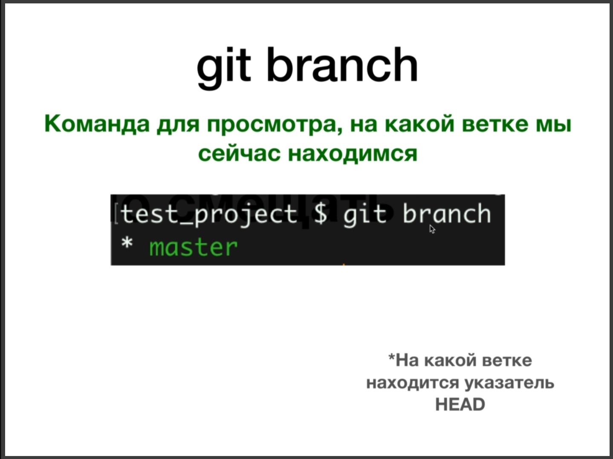

С помощью команды **git branch** мы можем посмотреть на какой ветке мы сейчас находимся. Данная команда показывает на какой ветке находится указатель **HEAD** т.е. текущий коммит на котором мы находимся.

С помощью команды **git branch** с флагом **-d** и указанным названием ветки мы можем удалить данную ветку.

Так же с помощью команды **git checkout** мы можем переключаться между ветками.

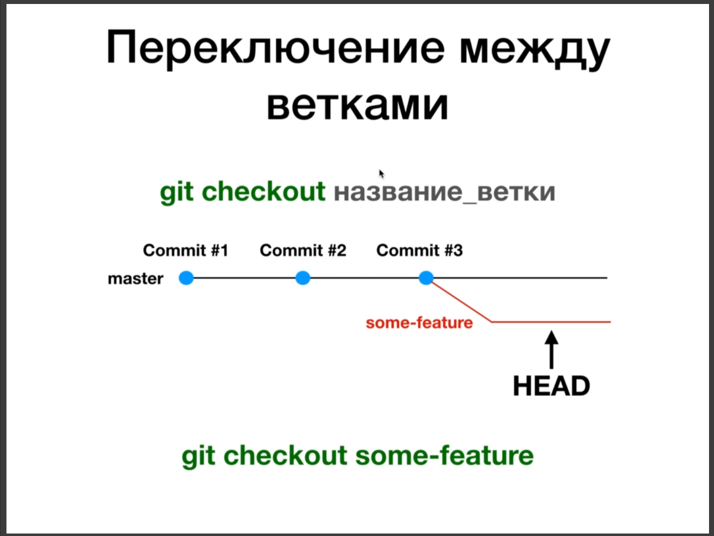

И конечно же команда **git merge** которая сливает одну ветку с другой.

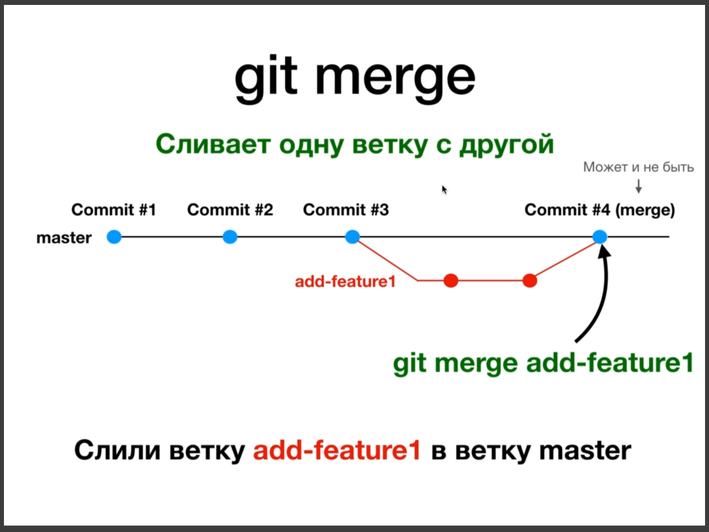

Находясь на ветке **master** мы должны вызвать **git merge** и передать название ветки с которой хотим произвести слияние.

Практика тренируюсь. Создаю ветку **add-feature1**

Появилась новая ветка, но мы еще находимся в **master**. Переключаюсь на вновь созданную ветку **git checkout add-feature1**.

Теперь в редакторе могу что-то создавать.

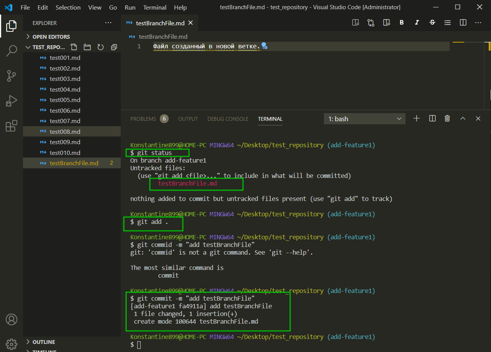

И далее пробую перейти назад в ветку **master**.

И как видим созданный мной файл в данной ветке отсутствует.

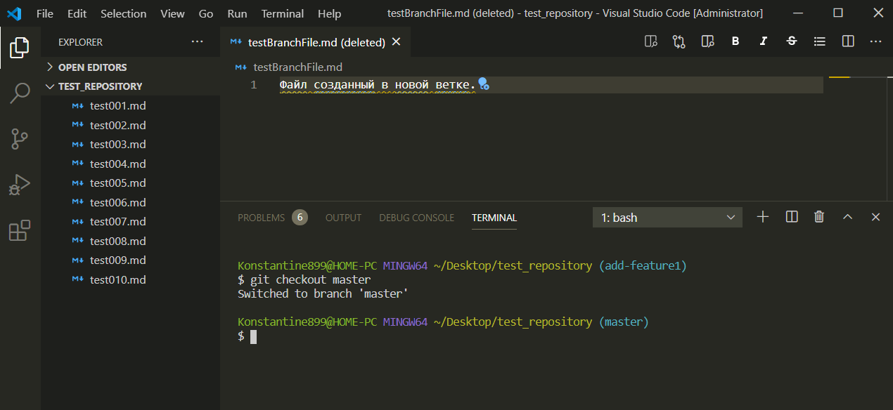

Теперь я сделаю слияние веток. Перехожу в ветку **master** и выполняю команду **add merge** и указываю название ветки **add-feature1**.

Коммит который был в **add-feature1** появился в ветке **master**.

После того как все изменения слиты в стабильную ветку мы можем удалить ветку **add-feature1**.

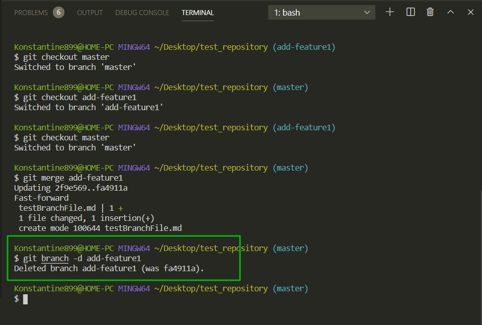

Теперь у нас осталась одна ветка **master**.

Идем далее. При слиянии **GIT** сообщил что наше слияние **Fast-Forward merge**

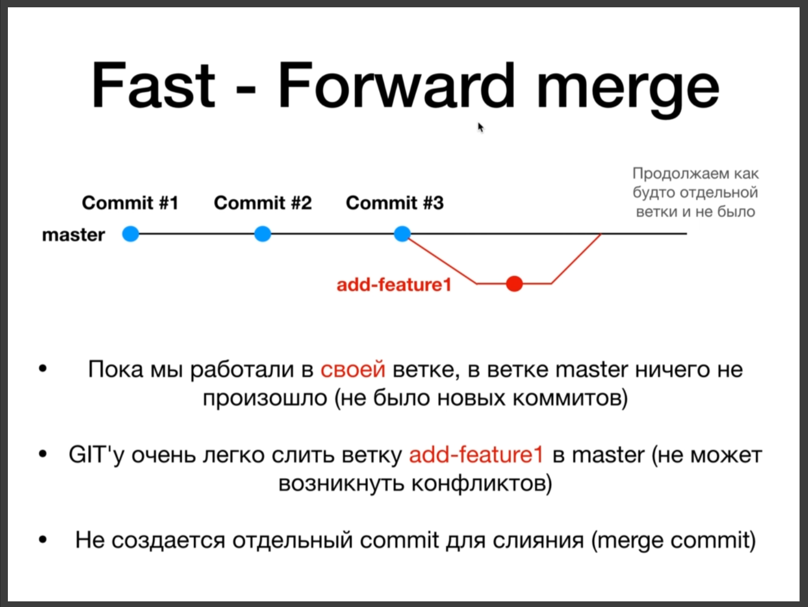

Это когда слияние бывает без конфликтов. Однако бывают и другие случаи.

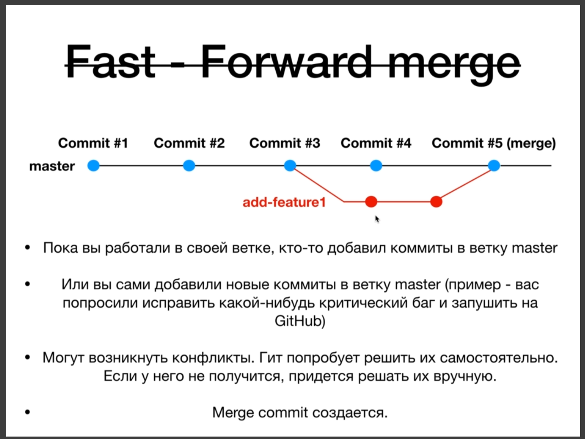

Кгда такое происходит вместо сообщения **Fast-Forward**, при слиянии, появляется сообщение в котором указано **recursive** т.е. произошло рекурсивное слияние. Он сделал слияние и создал отдельный **merge commit**. Хотя конфликтов не происходит.

Если после содания ветки появляется коммит в ветке мастер. Или мы редактируем один и тот же файл в разных ветках, то при слиянии появится конфликт, потому что **git** не может решить сомостоятельно и в этом случае нам придется внучную решать конфликты слияния.

О решении конфликтов поговорим в одном из следующих уроков.

Для того что бы провести практику давайте представим что у нас с репозиторием работает два человека. Буду делать скрины с видео. Создаю папки **user1** и **user2** и открываю их в терминале.

Скачиваю в них тестовый репозиторий.

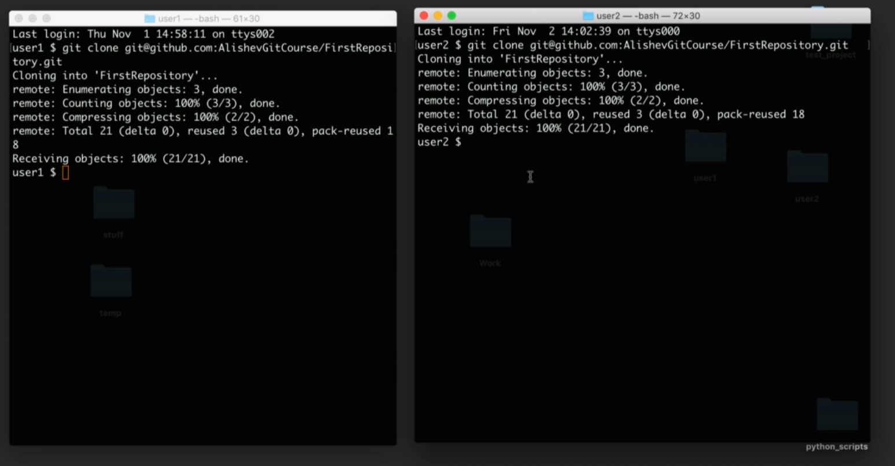

Данные папки связаны с одним репозиторием.

Теперь разберем два сценария. В первом сценарии у нас будет **Fast Forword** слияние потому что только один пользователь будет что - то добавлять на удаленный репозиторий. Но представим что у нас пользователь 2 что-то меняет в репозитории.

Второй пользователь меняет файл.

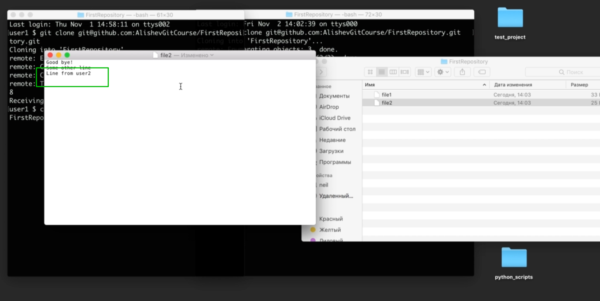

И второй пользователь делает коммит и добавляет на удаленный репозиторий.

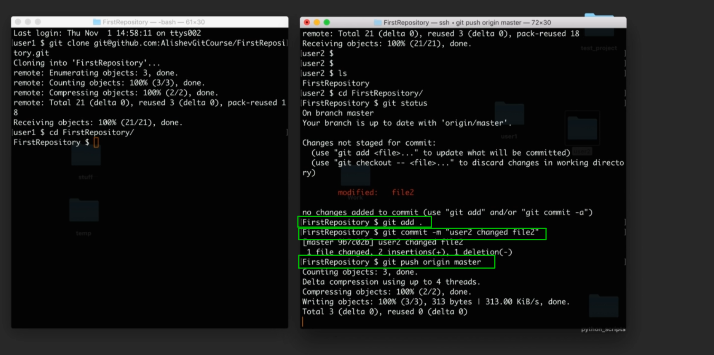

И теперь допустим первый пользователь хочет сделать **pull** с нашего удаленного репозитория. И у нас произойдет так называемое **Fast Forword** слияние потому что гиту было очень легко слить нашу удаленную и локальную ветку.

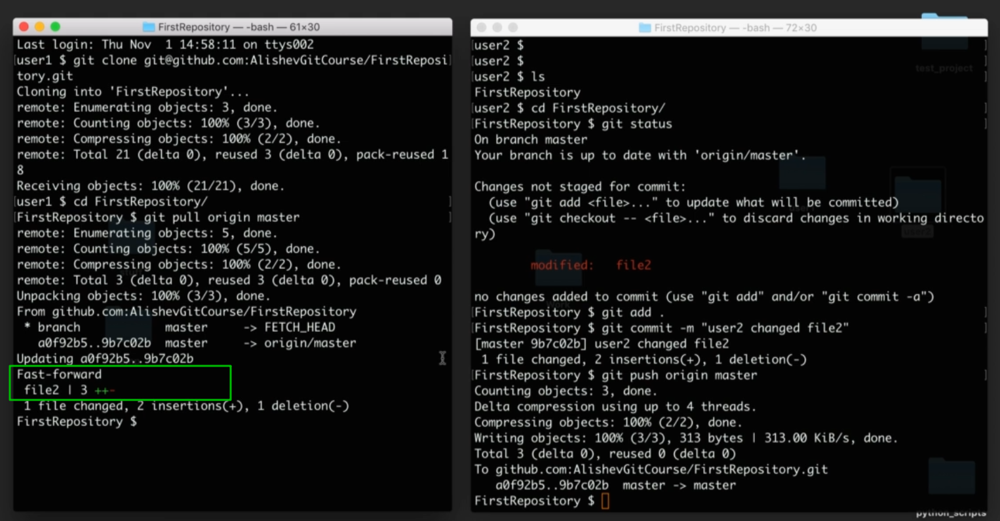

Что же произошло в этом примере?

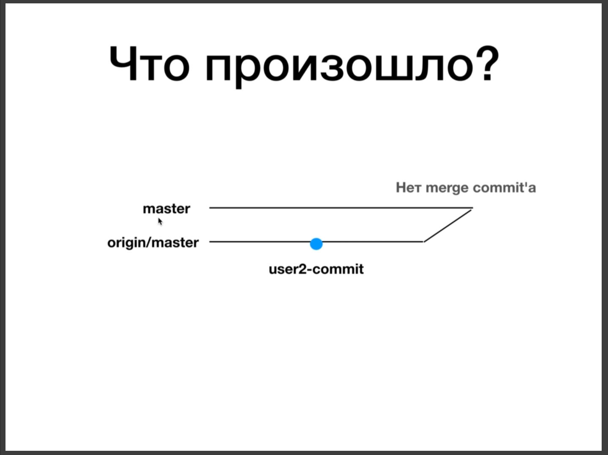

У пользователя **1** есть своя локальная ветка **master**. Когда мы сделали **pull** у пользователя **1** мы сначало сделали **fetch** т.е. мы обновили удаленную ветку **origin/master** и в ней появился новый коммит который пришел у нас с удаленного репозитория который был сделан **user2**, и затем команда **git pull** она сделала слияние. В результате слияние не создалось merge коммита потому что это у нас простой сценарий

Разберем другой сценарий.

Теперь предположим что данные пользователи будут работать одновременно т.е. они будут одновременно делать свои коммиты.

Изменяем **file1** у первого пользователя. Мы до сих пор будем делать изменения которые не приведут к конфликту. Конфликты разберем позже. У пользователя **2** меняю **file2**. Это не приведет к конфликту так как мы меняем разные файлы.

У нас два пользователя одновременно изменили разные файлы. И давайте скажем что пользователь **2** он сделает **push** раньше. Как обычно добавляю изменения в отслеживаемую зону, делаю коммит и **push** на удаленный репозиторий.

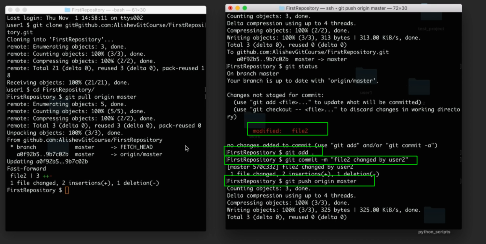

Теперь первый пользователь попробует добавить коммит на удаленный репозиторий.

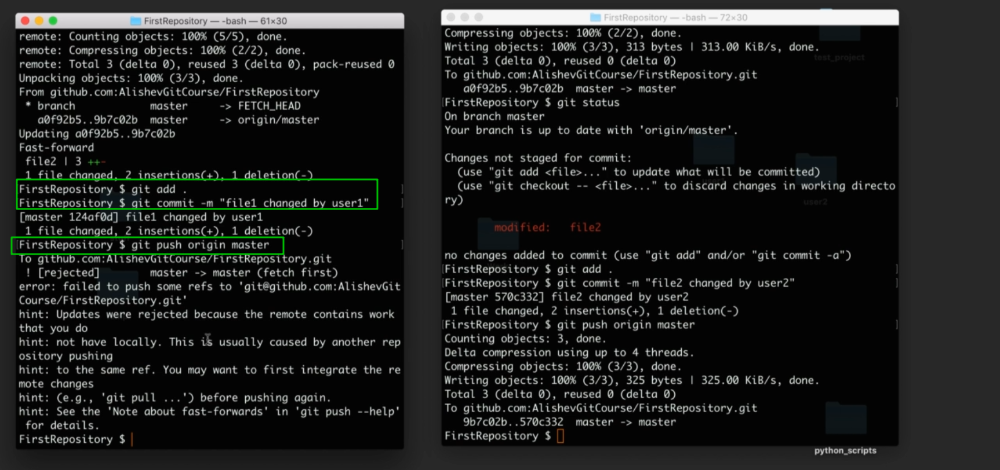

И вот у нас возникает конфликт. **Git** выдал ошибку о том что у него не получается запушить жтот коммит на удаленный репозиторий потому что у нас у самих есть какие-то коммиты которые есть на удаленном репозитории, но локально у нас их нет. Поэтому мы сначало должны сделать **pull** что бы актулизировать нашу локальную версию с удаленной версией репозитория и только потом мы сможем сделать push и добавить свои собственные изменения.

Делаю **git pull origin master** и здесь в отличии от предыдущего сценария откроется редактор **vim**.

> Долго разбирался как выйти из этого редактора. Оказывается нужно нажать Esc для того что бы выйти из режима редактирования и войти в режим ввода команд. И после чего ввести команду :wq - сохранить файл и выйти из Vim. После выхода будет произведено рекурсивное слияние удаленного и локального репозитория.

Это не **Fast Forword** слияние. Потому что у нас произошло следующее. У нас пока пользователь **1** работал, пользователь 3 тоже работал и слил свой коммит на удаленный репозиторий.

Когда пользователь **1** сделал **pull** мы сливаем то что у нас на удаленном репозитории в ветке **master** с нашей локальной веткой **master**. Делается это потому что на удаленном репозитории появился **merge commit**.

Теперь после того как пользователь **1** сделал **git pull** **origin master**, его локальный репозиторий стал актуальным, он может залить свой коммит на удаленный репозиторий.

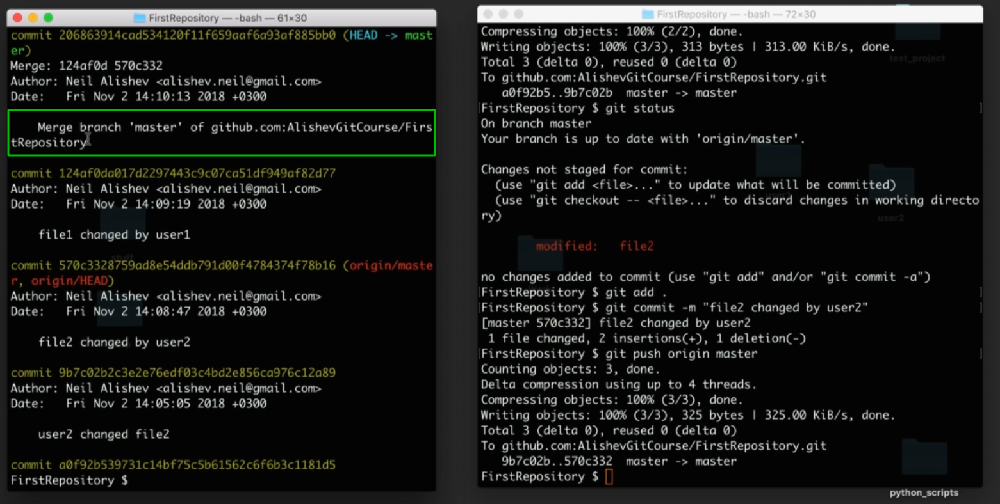
