# Конфликты слияния.

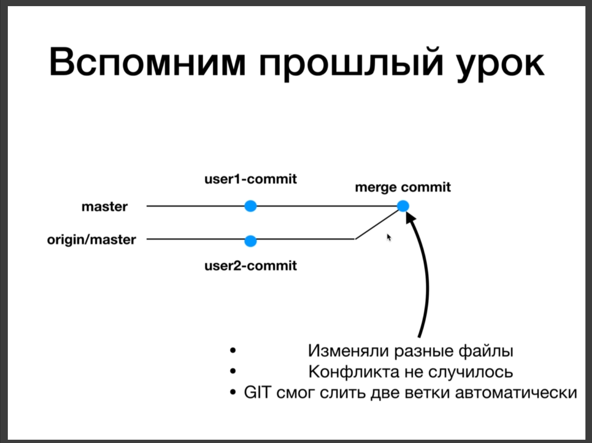

Что если два пользователя изменили один и тот же файл? Если мы попробуем слить эти две ветки то у нас возникнет так называемый **merge** конфликт.

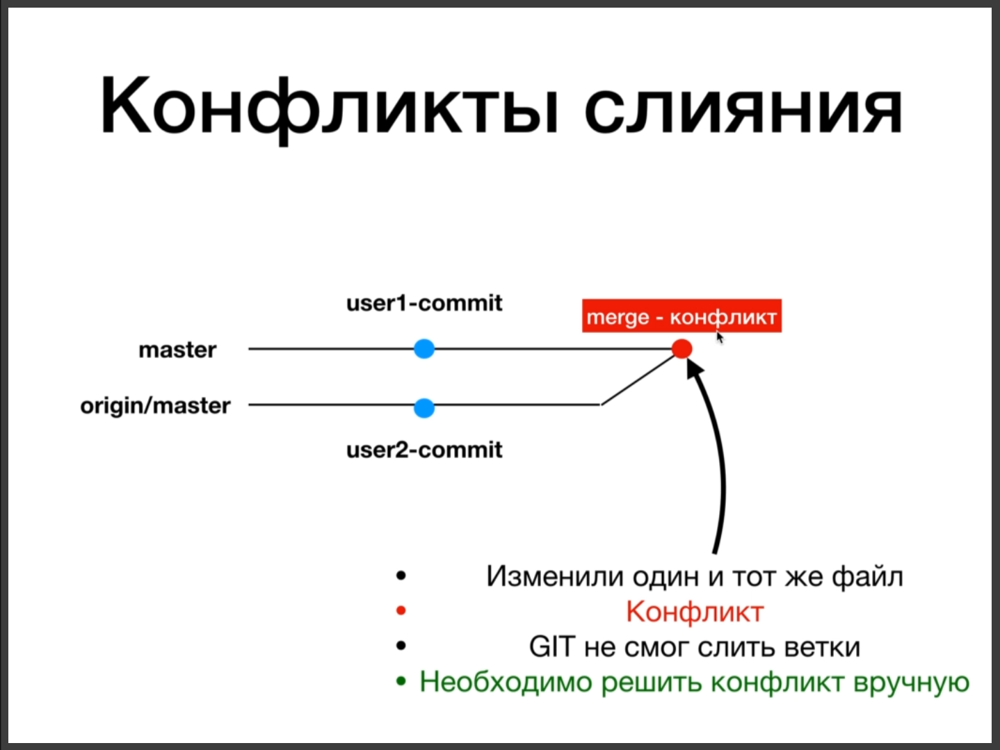

И в этом случае **git** не сможет слить ветки автоматически и нам придется решить конфликт в ручную.

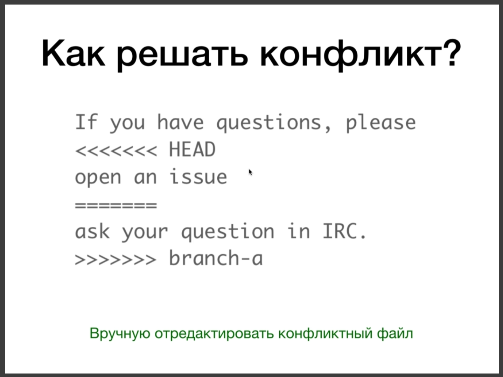

Когда у нас возникнет конфликт слияния у нас в файле в котором произошол конфликт будет оставлена пометка указанаая на скрине выше. О том что в этом месте и в этом файле произошел конфликт слияния. Если вы хотите решить этот конфликт, вам нужно в этом месте решить откуда вы хотите забирать изменения, из вашей ветки или из какой-то чужой ветки. В указателе **HEAD** мы видим что начинается зона конфликта и заканчивается в **branch -a**. И в этой строчке **open an issue** ваша версия этой строчки в этом файле. А версия **ask your question in IRC** представлена в другой ветке. Т.е. **GIT** не может выбрать какую версию этой строчки взять. И по этому вам нужно самому решить какую версию строчки в этом файле вам нужно взять.

Когда вы в ручную отредактируете этот конфликтный файл, вы сможете решить конфликт слияния и слить эти две ветки.

Перехожу к практике.

Как обычно у нас будет несколько сценариев. В первом сценарии мы будем изменять одно и то же место в одном и том же файле в ветке **master** и в какой-нибудь созданной ветке.

У нас четыре файла в репозитории и одна ветка **master**.

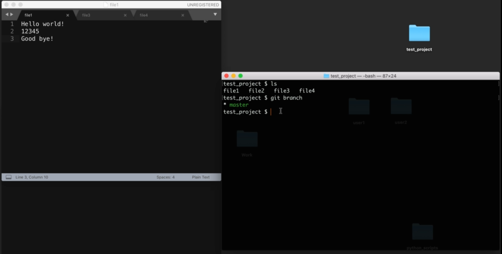

Создаю новую ветку **git branch add-feature1** и переключаюсь в данную ветку. Изменяю **fale1** в котором делаю пометку в какой ветке я внес изменения. Делаю коммит.

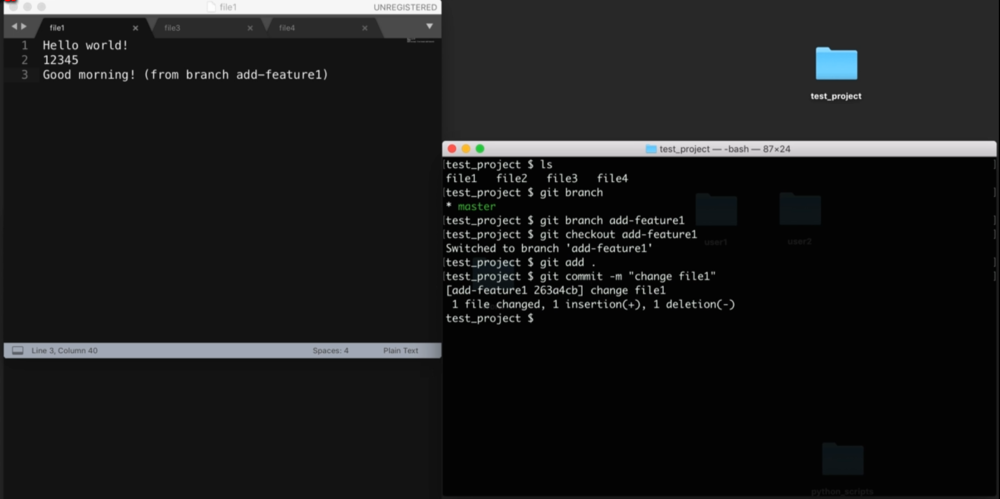

Перехожу в ветку **master**. И предположим что мы фиксим баг в том же файле но в ветке **master**.

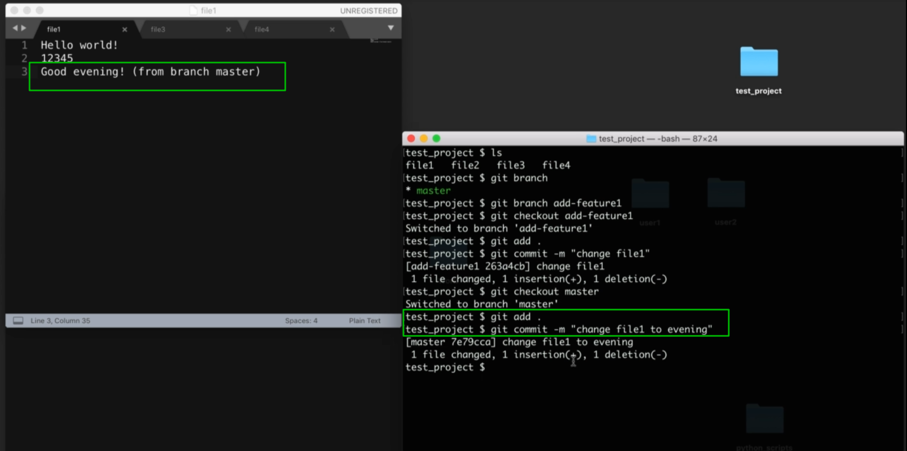

Теперь мы можем ветку **add-feature1** влить в ветку **master**. Так получилось что изменения в **file1** из ветки **add-feature1** пересекаются с изменениями **file1** из ветки **master**.

И теперь если я захочу слить ветки **git** не будет знать из какой ветки доставать вот эту строчку.

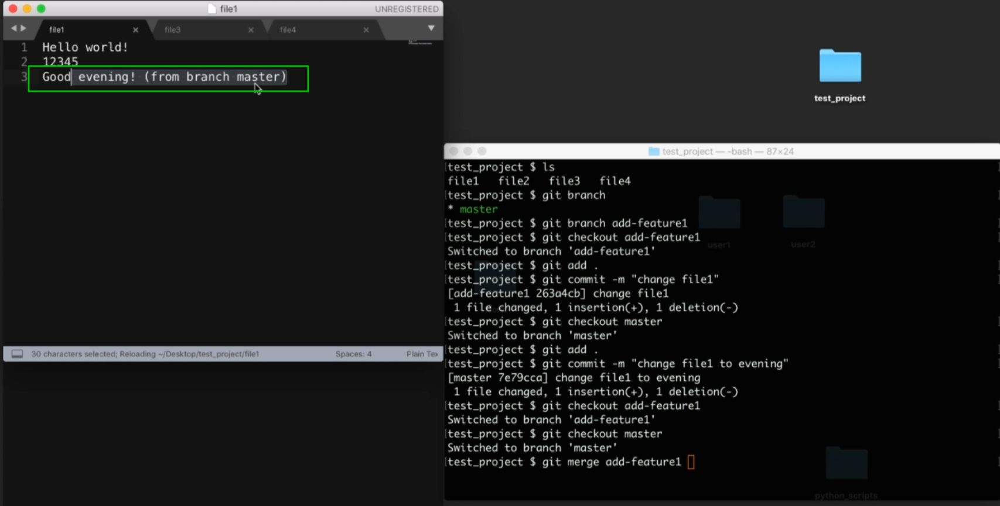

Или нам стоит принять версию файла из ветки **add-feature1**.

При слиянии **Git** скажет что нам нужно слить данные ветки вручную.

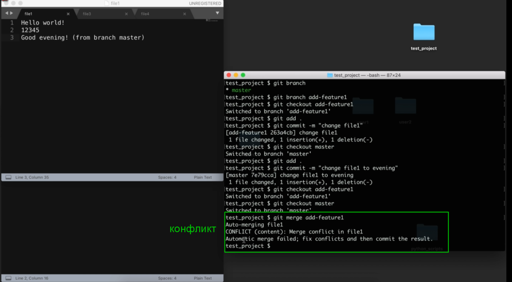

Автоматическое слияние провалено т.е. оно не завершено.

Если мы наберем команду **git status** мы увидим что у нас есть конфликт в **fale1**.

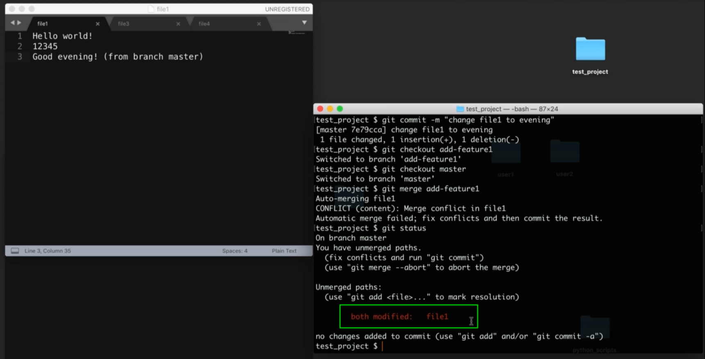

т.е. обе ветки изменили **file1**.

Теперь посмотрим на содержимое нашего **fale1**.

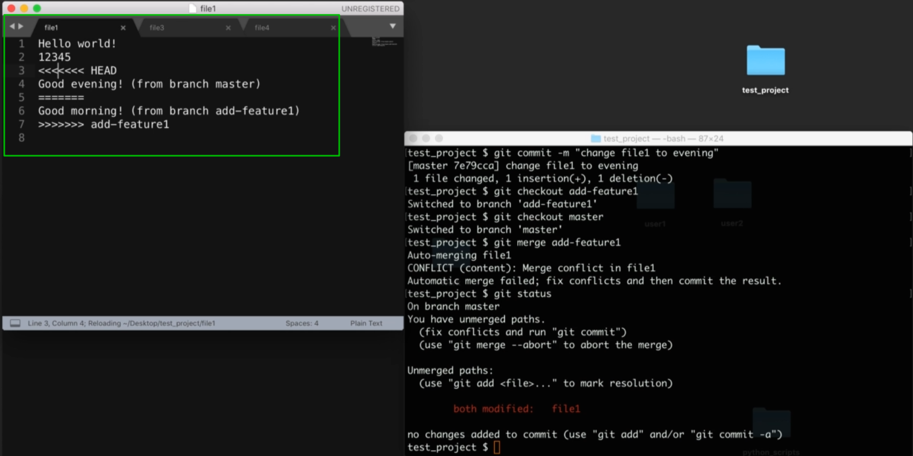

**GIT** нам оставил пометку о том что в этой зоне у нас находится конфликт. В той ветке на которую смотрит указатель **HEAD** у нас вот такая версия этой строчки. После знаков равенств у нас идет другая версия.

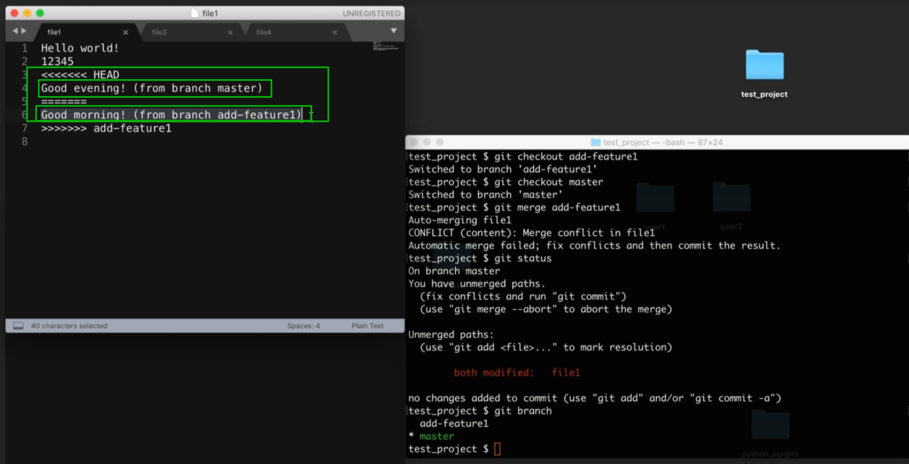

И здесь вы должны вручную отредактировать этот файл. давайте кажем что мы хотим принять версию из ветки **master**.

Для того что бы внести нужные нам изменения в редакторе удаляю то что мне не нужно.

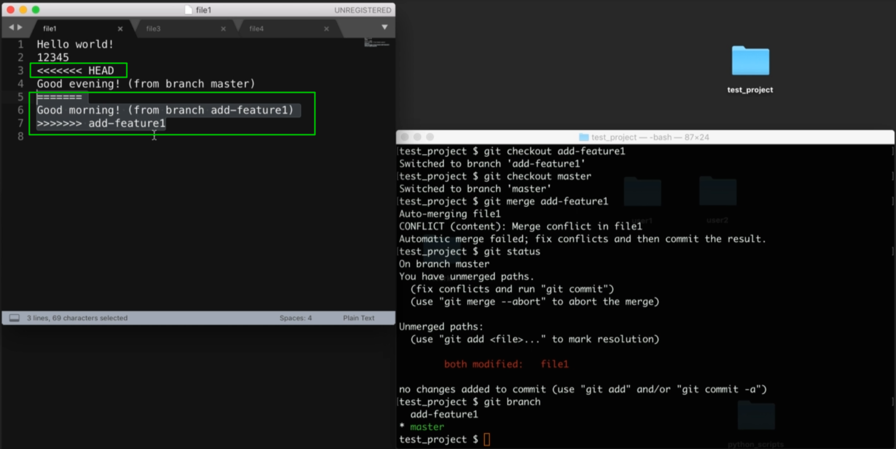

Созраняю файл.

И теперь что мы должны сделать что бы решить конфликт? Мы должны добавить изменения в отслеживаемую зону **git add .** . Далее мы должны сделать **git commit** этой командой мы в ручную создадим **merge commit** или коммит слияния. Т.е. раньше **GIT** за нас создавал этот коммит слияния. Но в этот раз мы должны создать этот коммит сами.

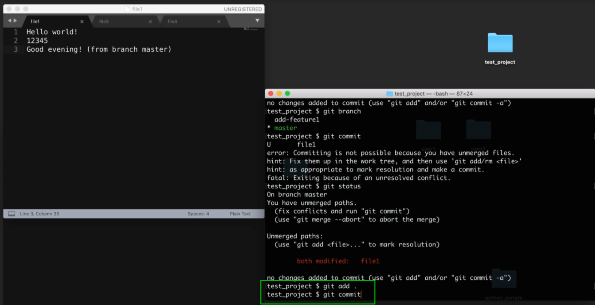

После чего происходит переброс в редактор **Vim** в котором с помощью **Esc** выхожу из режима редактирования в вхожу в режим ввода команд и ввожу **:wq**.

После выхода создается коммит и происходит успешное слияние.

Далее я могу удалить ветку за не надобностью **git branch add-feature1**.

Давайте рассмотрим проблему конфликта слияния когда два отдельных пользователя работают с одним удаленным репозиторием как в прошлых примерах.

Давайте у пользователя **2** совершим какое-то изменение.

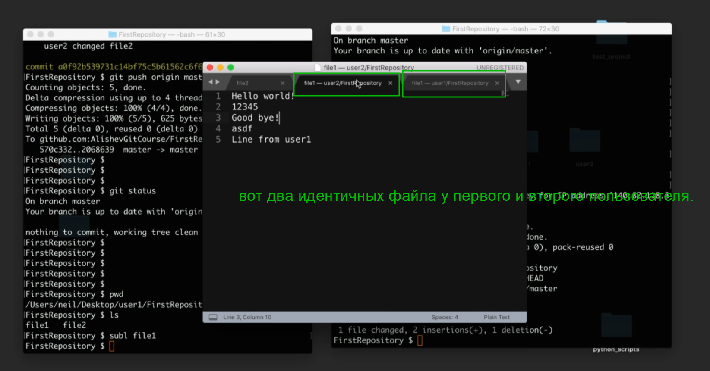

У них соответственно идентичная история коммитов.

Теперь пользователь **2** меняет **file1**, делает коммит и добавляет на удаленный репозиторий.

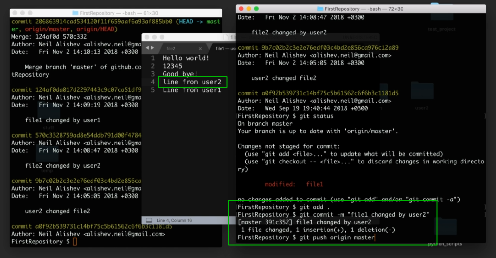

Теперь представим что в этот же момент времени пользователь **1**, у которого тот же самый файл и та же история коммитов, он изменяет этот же файл в этом же самом месте.

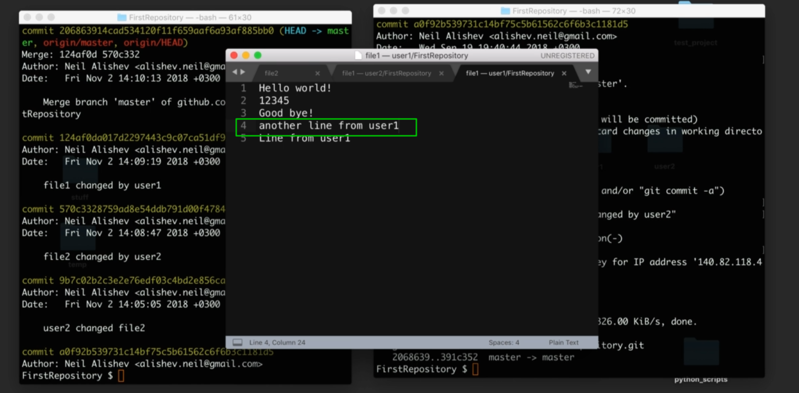

Ну вы можете представить что это в ходе работы довольно часто встречается. Теперь попробуем запушить эти изменения. Т.е. у нас пользователь **1** не знает что пользователь **2** уже внес изменения.

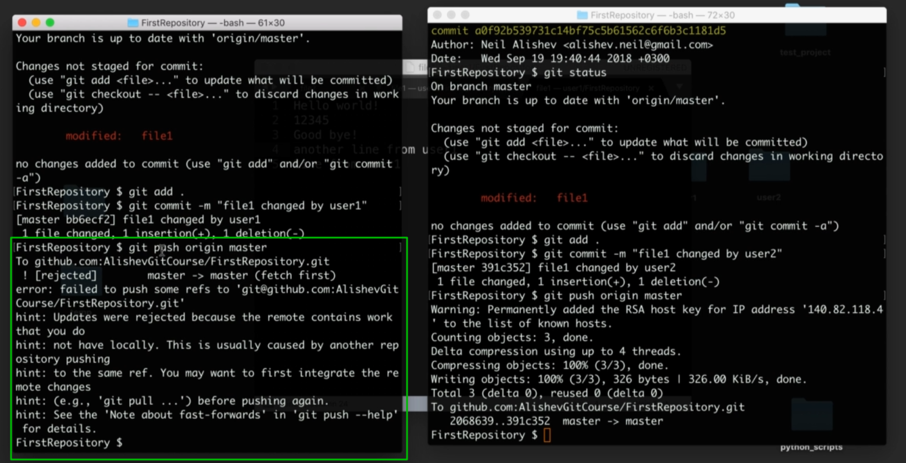

Нам **GIT** говорит что он не может этого сделать потому что на удаленном репозитории есть какие-то коммиты о которых не знает локальный репозиторий первого пользователя.

Давайте подцепим эти коммиты для того что бы их слить в нашу локальную ветку т.е. актулизировать нашу ветку мастер локального репозитория.

Для этого я делаю **git pull origin master**. И тут у нас возникнут проблемы. Потому что **git pull** он делает **fetch** что бы достать свежие данные с удаленного репозитория, но более того он еще делает **merge** т.е. от пытается **merge**(объеденить) ветку удаленного репозитория в нашу локальную ветку т.е. в нашу в данном случае ветку **master**.

Для этого я должен посмотреть **git status** где я увижу что файл изменен двумя ветками и его нужно вручную отредактировать.

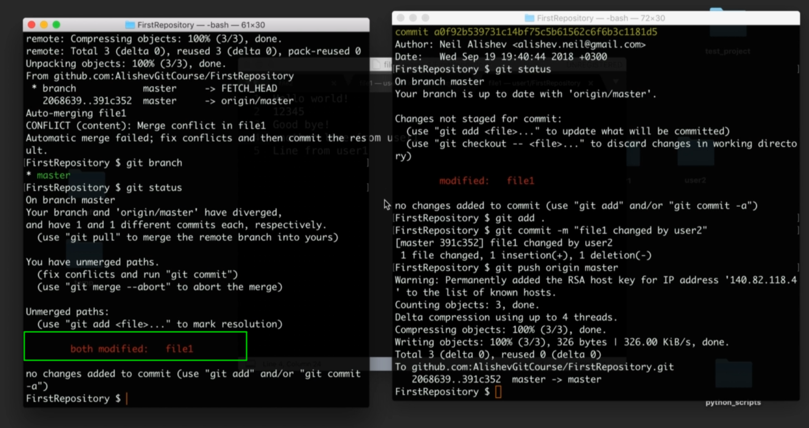

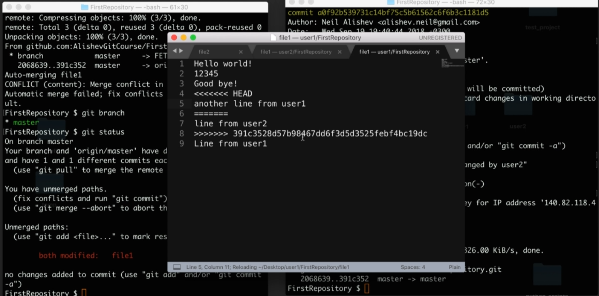

И здесь мы видим те же указания от **git**. Во-втором случае нам пришел уникальный индентификатор коммита второго пользователя. Лишнее удаляю и принимаю то что пришло от удаленного пользователя.

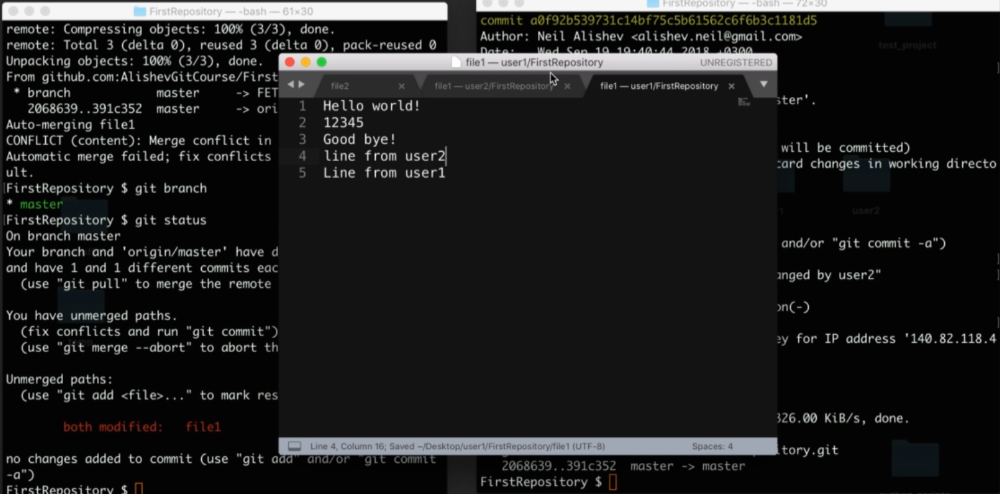

В итоге у нас будет вот такой конечный вариант. Далее делаю **git add .** и **git commit**.

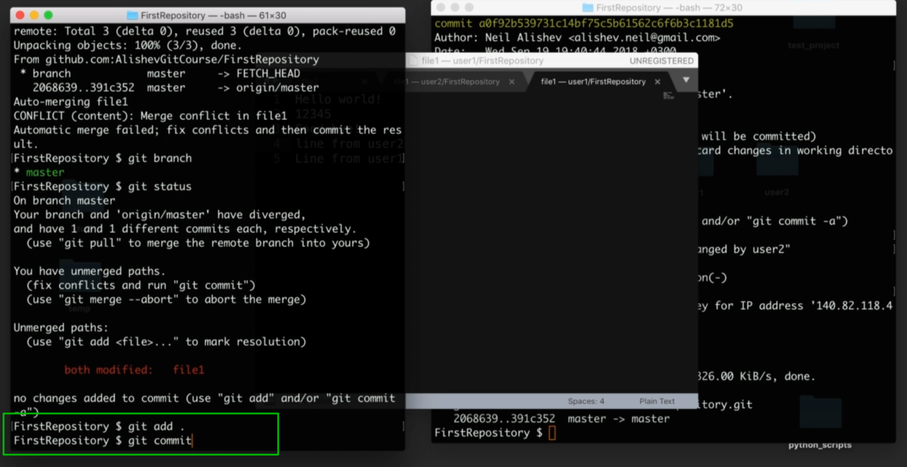

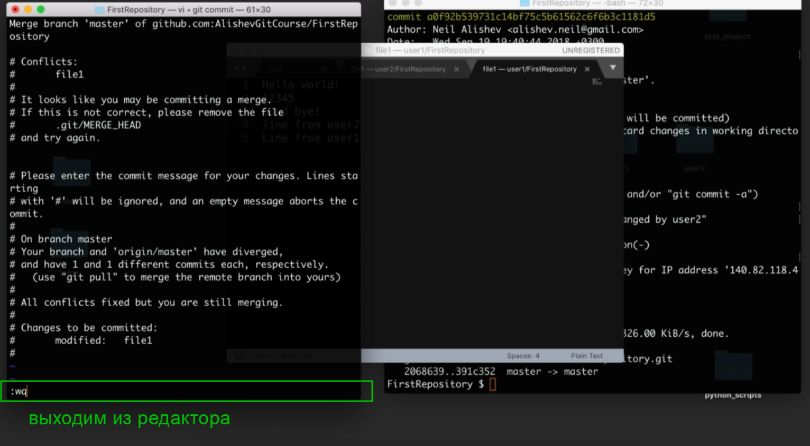

Таким образом происходит успешный коммит слияния который в качестве конечного варианта берет вариант от второго пользователя. И теперь мы можем это запушить на удаленный репозиторий и таким образом обновить данные на нем.

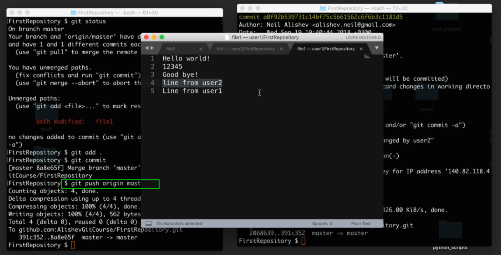

Обычно о таком слиянии принимает решение какой-то главный программист.
