# Branching (Ветвление)

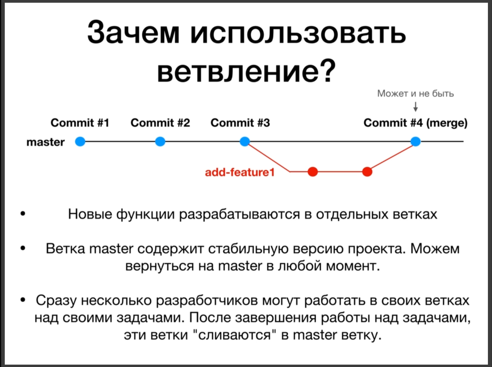

В ветке мастер обычно хранится стабильная версия проекта, а вот в других ветках содержатся отдельные функции проекта. Это делается потому что мы не хотим какие-то не стабильные функции внедрять в нашу стабильную версию проекта.

Отдельные ветки не влияют на работоспособность главной ветки, не влияет на работоспособность главной стабильной версии.

Когда ответвленная ветка доходит до какого-то состояния т.е. до стабильной работоспособности, когда код стабилен, этот код, эту ветку можно слить в главную ветку. Теперь в главной ветке появляется та функция которая разрабатывалась в отдельной ветке. Т.е. это очень удобный способ распределения работы и обезопашивания главной ветки для стабильной работы.

После слияния может создаваться особый коммит или **commit merge** но это не всегда происходит. Разберем это позже.

Основные команды для работы с ветками.

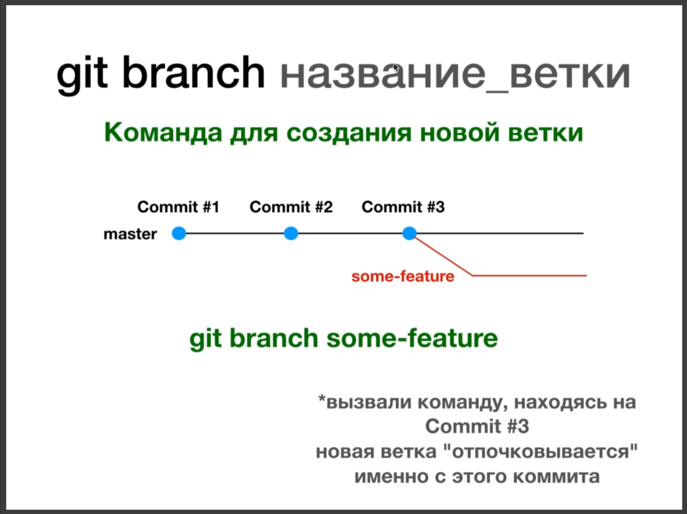

**git branch** - эта команда служит для создания новой ветки. К примеру мы находимся на третьем коммите, как показано на слайде. Набираю **git branch some-feature** после чего происходит создания новой ветки.

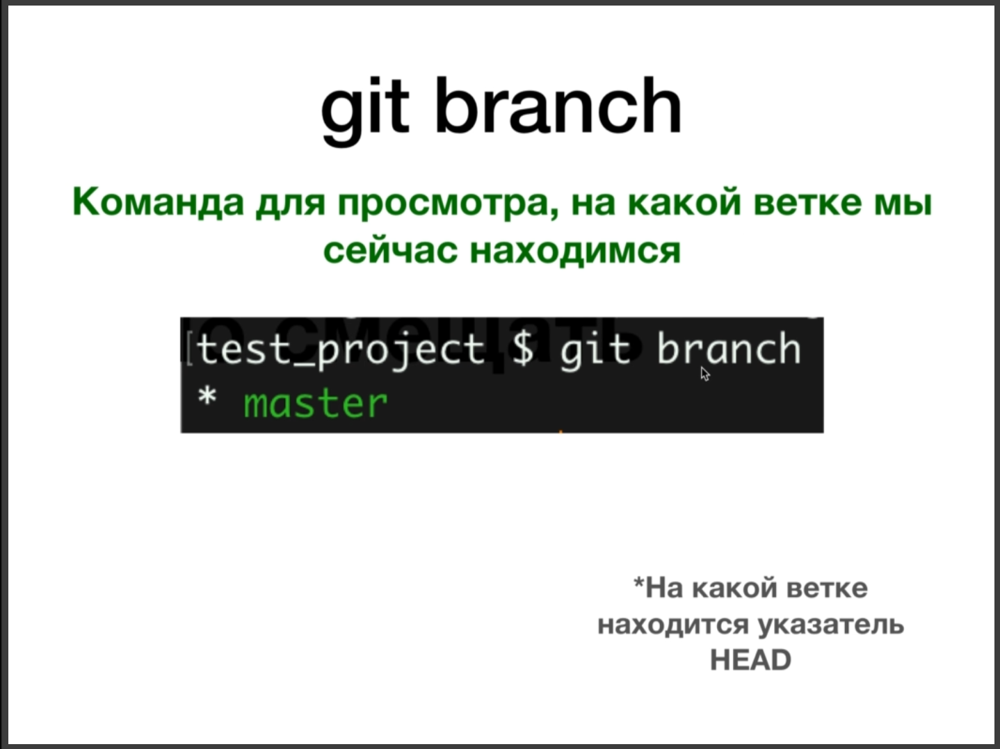

С помощью команды **git branch** мы можем посмотреть на какой ветке мы сейчас находимся. Данная команда показывает на какой ветке находится указатель **HEAD** т.е. текущий коммит на котором мы находимся.

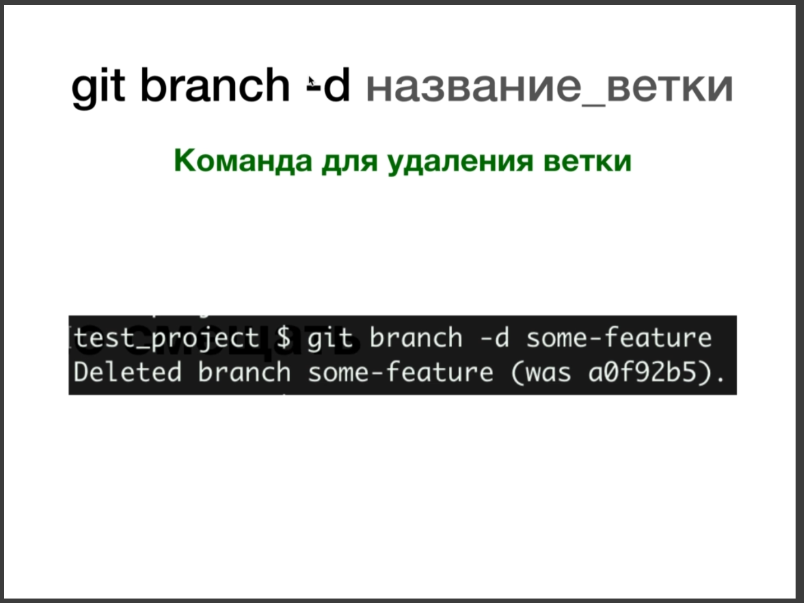

С помощью команды **git branch** с флагом **-d** и указанным названием ветки мы можем удалить данную ветку. 

Так же с помощью команды **git checkout** мы можем переключаться между ветками.

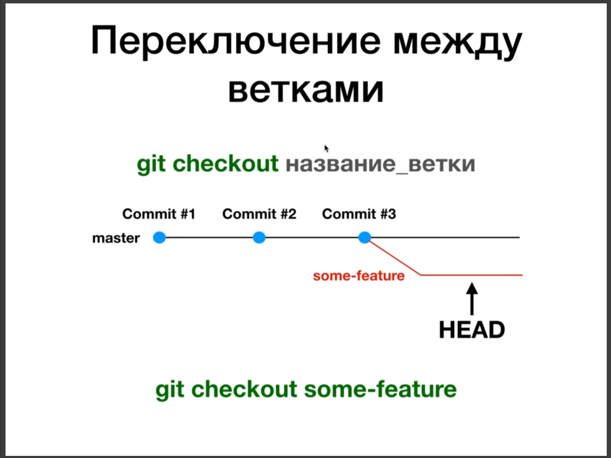

И конечно же команда **git merge** которая сливает одну ветку с другой.

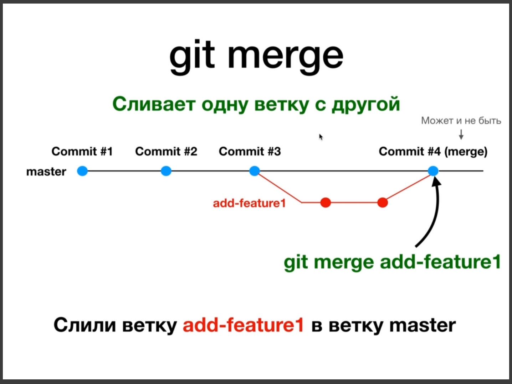

Находясь на ветке **master** мы должны вызвать **git merge** и передать название ветки с которой хотим произвести слияние.

Практика тренируюсь. Создаю ветку **add-feature1**

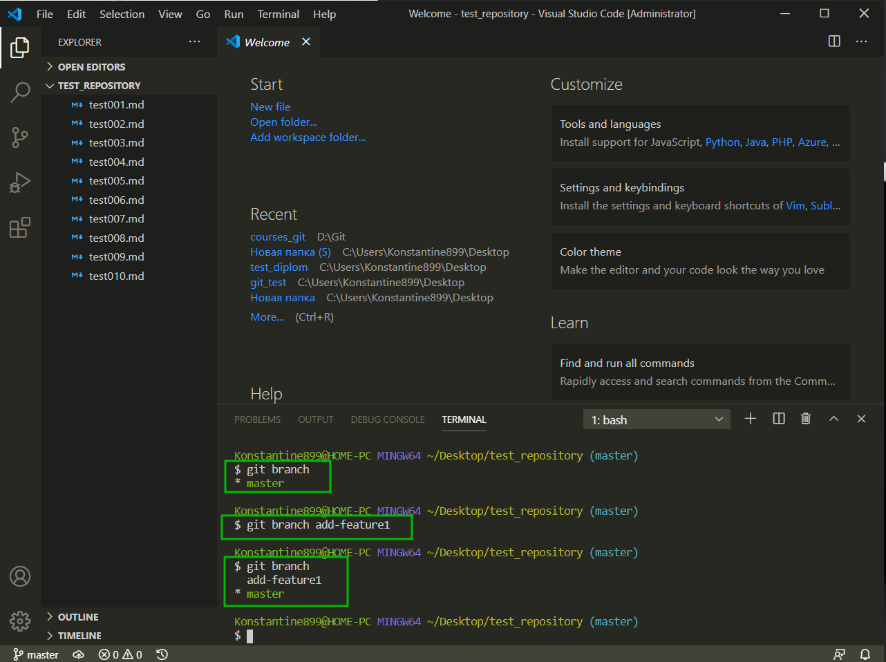

Появилась новая ветка, но мы еще находимся в **master**. Переключаюсь на вновь созданную ветку **git checkout add-feature1**.

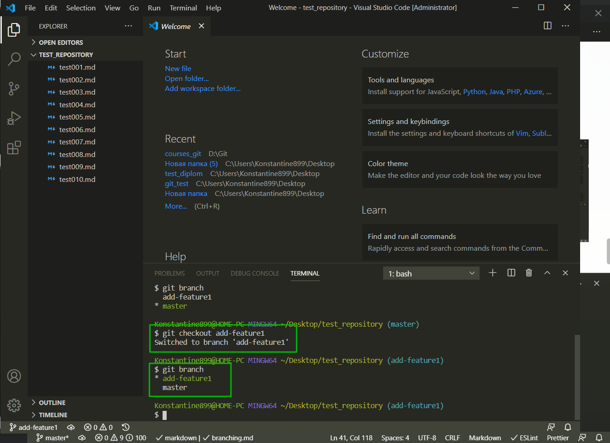

Теперь в редакторе могу что-то создавать.

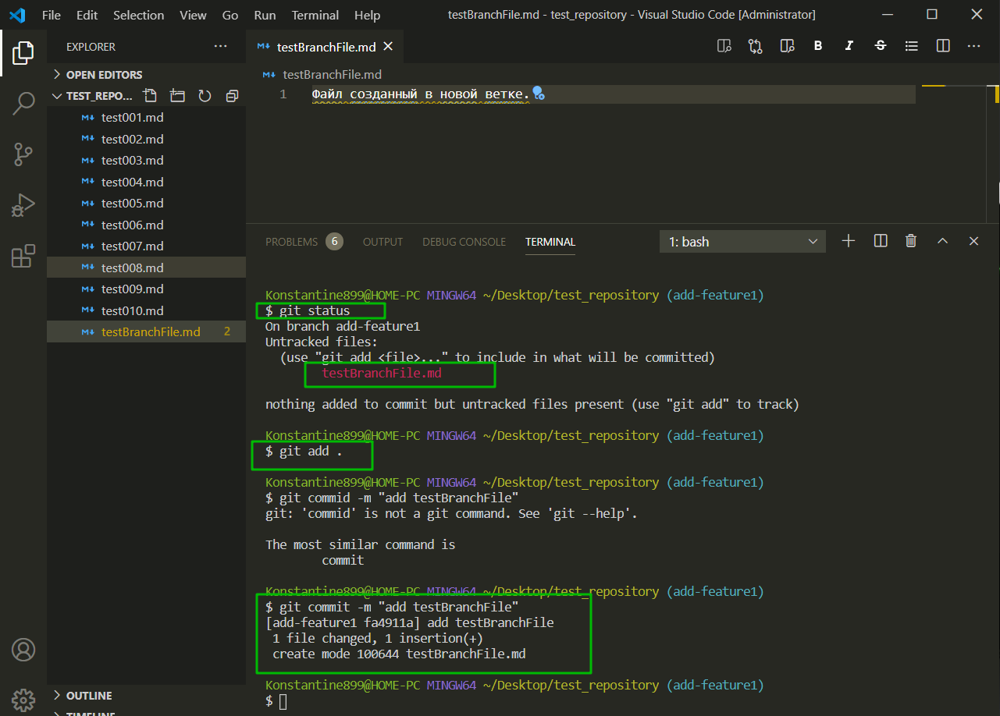

И далее пробую перейти назад в ветку **master**.

И как видим созданный мной файл в данной ветке отсутствует.

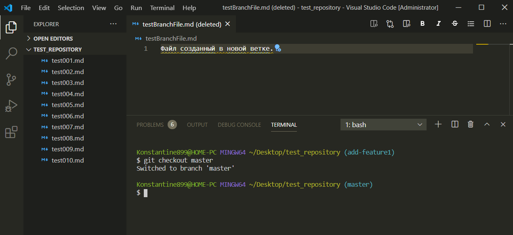

Теперь я сделаю слияние веток. Перехожу в ветку **master** и выполняю команду **add merge** и указываю название ветки **add-feature1**.

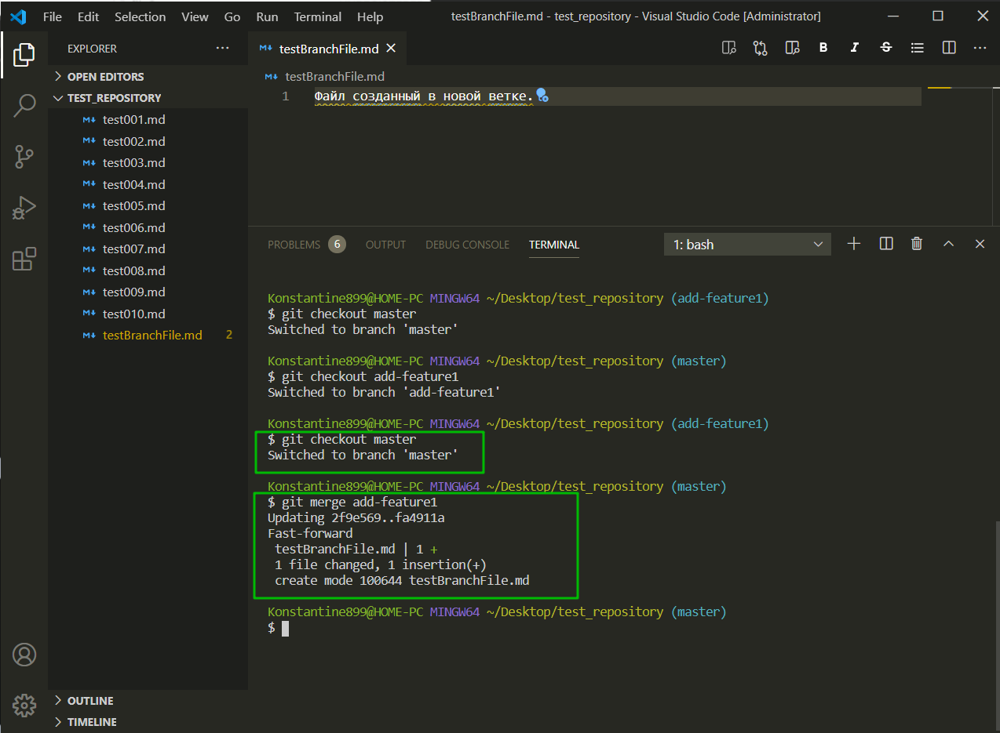

Коммит который был в **add-feature1** появился в ветке **master**.

После того как все изменения слиты в стабильную ветку мы можем удалить ветку **add-feature1**. 

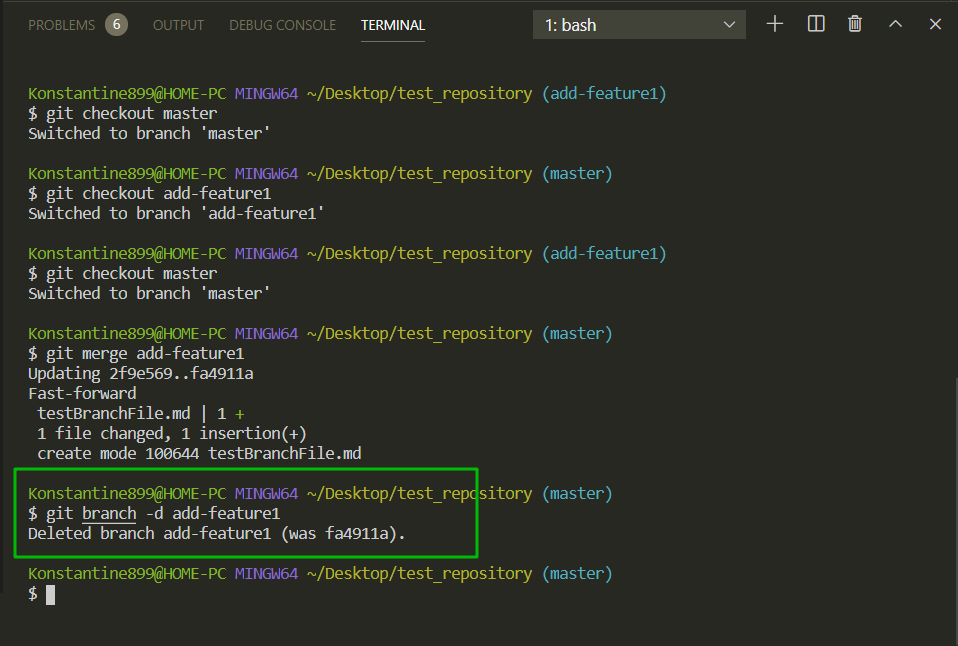

Теперь у нас осталась одна ветка **master**.

Идем далее. При слиянии **GIT** сообщил что наше слияние **Fast-Forward merge**

Это когда слияние бывает без конфликтов. Однако бывают и другие случаи.

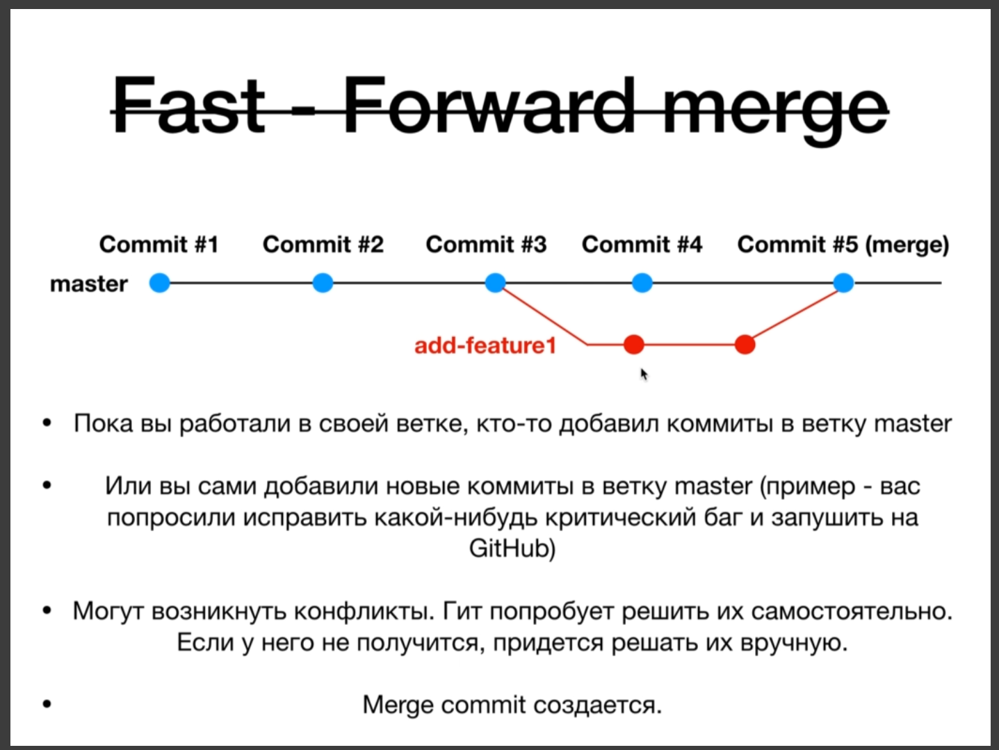

Кгда такое происходит вместо сообщения **Fast-Forward**, при слиянии, появляется сообщение в котором указано **recursive** т.е. произошло рекурсивное слияние. Он сделал слияние и создал отдельный **merge commit**. Хотя конфликтов не происходит.

Если после содания ветки появляется коммит в ветке мастер. Или мы редактируем один и тот же файл в разных ветках, то при слиянии появится конфликт, потому что **git** не может решить сомостоятельно и в этом случае нам придется внучную решать конфликты слияния.

О решении конфликтов поговорим в одном из следующих уроков.