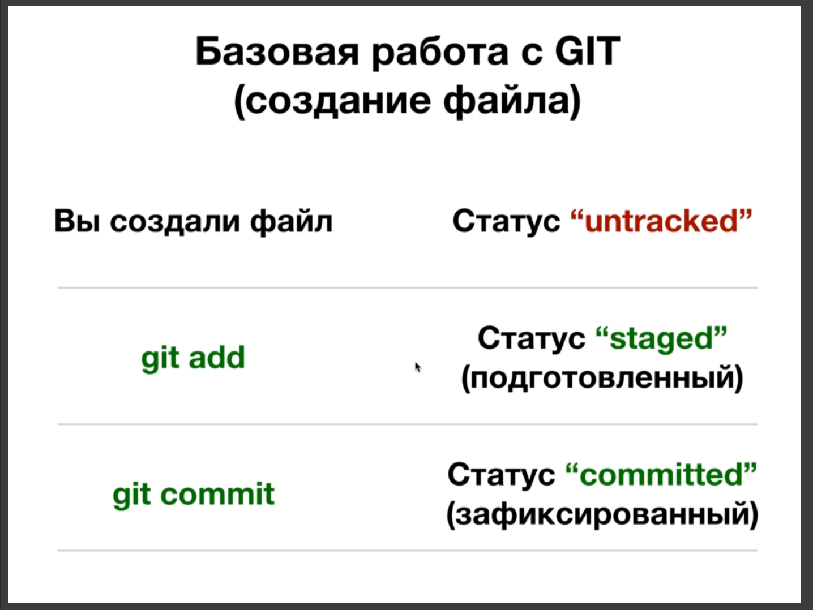

# Базовая работа с GIT (git add, git commit)

После создания файла у него появляется статус **"untracked"**(неотслеживаемый). Этот файл не находится в **git** т.е. он не отслеживаемый. Что бы его подготовить к комиту, к фиксации репозитория, нужно выполнить команду **git add**. С помощью этой команды перевожу статус файла в "**staged**"(подготовленный). Таким образом мы подгатавливаем файлы к **commit**(фиксации). Вы выбираете какие файлы вы хотите зафиксировать, снимок которых вы хотите сделать. И с помощью команды **git commit** вы делаете снимок ваших файлов. И ваши файлы переводятся в статус **committed**(зафиксированный). И вот такая работа с **git** будет примерно каждый раз повторяться.

При изменении файла происходит следующее.

При изменении присваивается статус **modified**(модифицированный). Когда вы изменили файл он не зарегистрирован в **git**. Нужно сделать **git add** что бы подготовить файл к **commit** и далее сделать **git commit** что бы сделать снимок этого файла.

**В git commit -m "Сообщение снимка"** - здесь содержится информация о вашем снимке к прмеру **git commit -m "edit file001"**.

 
 
 

**Практика**

Есть полезная команда **git log** она позволяет постмотреть все commit.