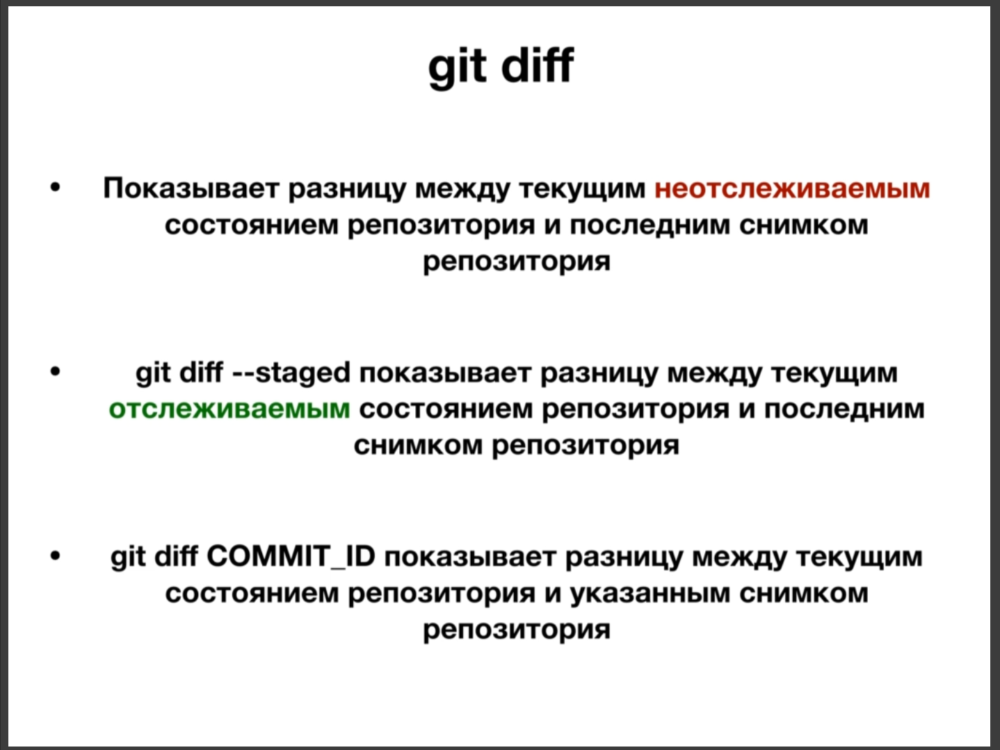
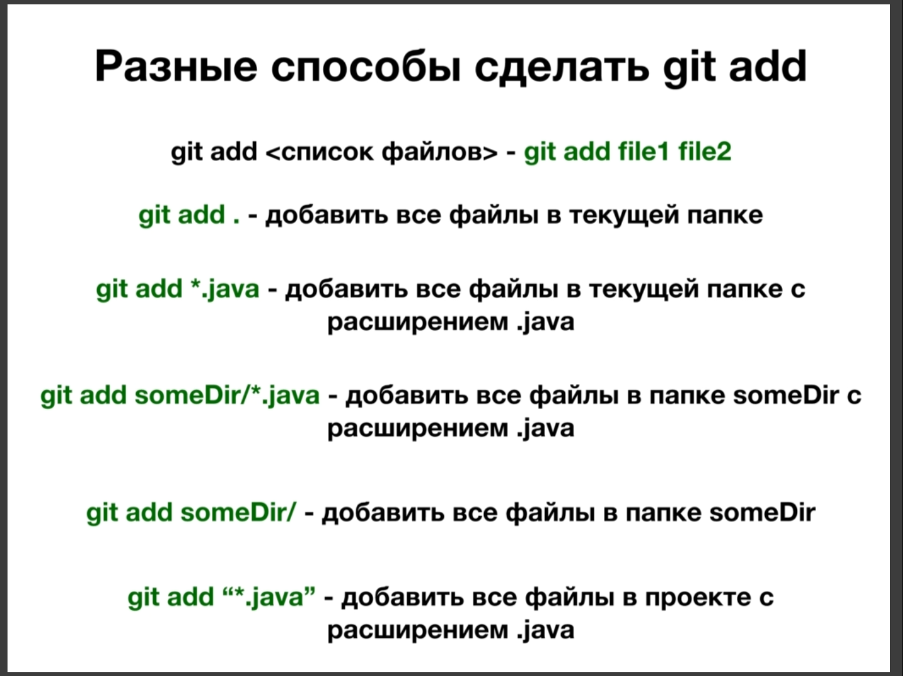
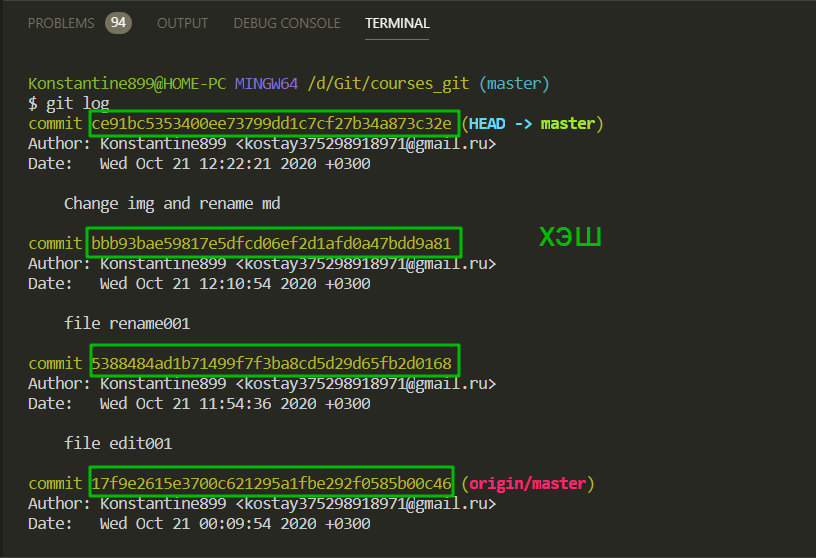
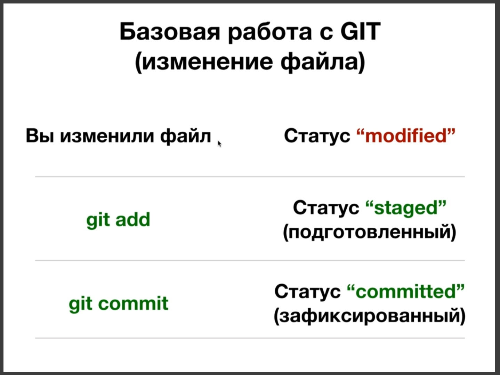

# Команда git diff

**git diff** получает свое название от **differance**(разница).



Как и большинство команд в **git** данная команда достаточно многофункциональная. Разберем различные сценарии использования этой команды.

Во - первых данную команду мы можем вызвать без параметров. Она покажет разницу между текущим не отслеживаемым состоянием репозитория и последним снимком репозитория.

**git diff --staged** и **git diff COMMIT_ID** смотри на скрине.

Смотрим как это работает. **git diff** ничего особого. Просто смотрим изменения. А вот изменения между отслеживаемым состоянием репозитория.

```js
$ git diff --staged
diff --git a/002.git_add_git_commit.md b/002.git_add_git_commit.md
index 22dc7aa..477f644 100644
--- a/002.git_add_git_commit.md
+++ b/002.git_add_git_commit.md
@@ -25,3 +25,4 @@

 

+Есть полезная команда **git log** она позволяет постмотреть все commit.
\ No newline at end of file
diff --git a/003.git_diff.md b/003.git_diff.md
new file mode 100644
index 0000000..2e90529
--- /dev/null
+++ b/003.git_diff.md
@@ -0,0 +1,13 @@
+# Команда git diff
+
+git diff получает свое название от differance(разница).
+
+
+
+Как и большинство команд в git данная команда достаточно многофункциональная. Разберем различные сценарии использования этой команды.
+
:
```

Более что интересно можно посмотреть все изменения от интересующего коммита. ввожу **git log** беру хэш интересующего коммита с которого я хочу посмотреть. И с помощью команды **git diff** далее вставляю хэш смотрю изменения.



```git
$ git diff bbb93bae59817e5dfcd06ef2d1afd0a47bdd9a81
warning: CRLF will be replaced by LF in 003.git_diff.md.
The file will have its original line endings in your working directory
warning: CRLF will be replaced by LF in 003.git_diff.md.
The file will have its original line endings in your working directory
diff --git a/002.git add git commit.md b/002.git add git commit.md
deleted file mode 100644
index dec5569..0000000
--- a/002.git add git commit.md
+++ /dev/null
@@ -1,16 +0,0 @@
-# Базовая работа с GIT (git add, git commit)
-
-После создания файла у него появляется статус **"untracked"**(неотслеживаемый). Этот файл не находится в **git** т.е. он не отслеживаемый. Что бы его подготовить к комиту, к фиксации репозитория, нужно выполнить команду **git add**. С помощью этой команды перевожу статус файла в "**staged**"(подготовленный). Таким образом мы
подгатавливаем файлы к **commit**(фиксации). Вы выбираете какие файлы вы хотите зафиксировать, снимок которых вы хотите сделать. И с помощью команды **git commit**
вы делаете снимок ваших файлов. И ваши файлы переводятся в статус **committed**(зафиксированный). И вот такая работа с **git** будет примерно каждый раз повторяться.
-
-
-
-При изменении файла происходит следующее.
-
-
-
: жми на Enter и увидишь дальнейшие изменения.
```

Эта команда учитыват не только отслеживаемые, но и не отслеживаемые, т.е. все изменения которые произошли.

Вот такие вот три сценария использования команды **git diff**.

Первый сценарий **git diff** позволяет узнать нам разницу между текущим не отслеживаемым состоянием репозитория и последним коммитом.

Второй сценарий **git diff staged** позволяет узнать разницу между текущим отслеживаемым состоянием репозитория и последним коммитом.

И третий сценарий **git diff COMMIT_ID** позволяет узнать все что произошло межу указанным коммитом и между текущим состояние репозитория.
