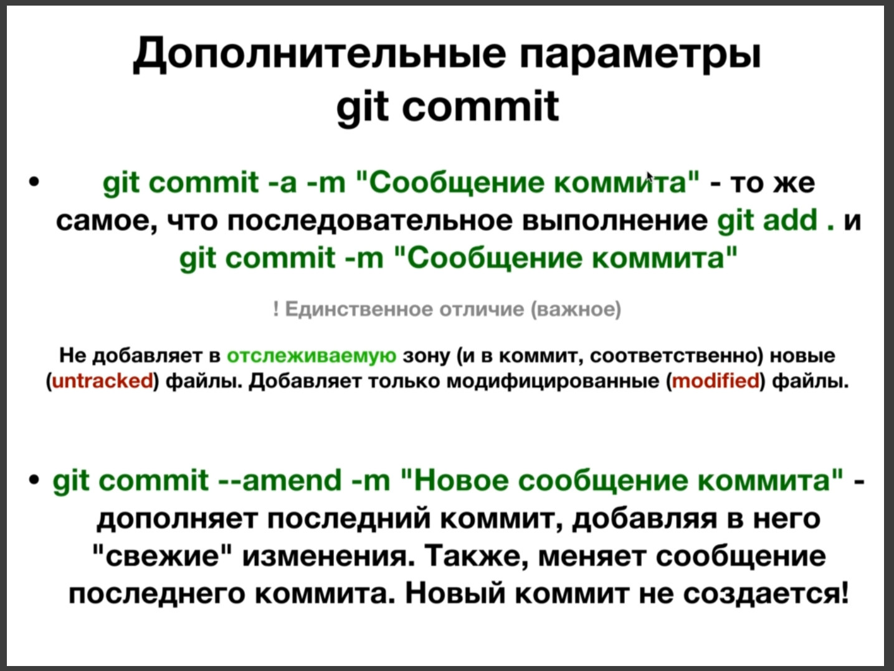
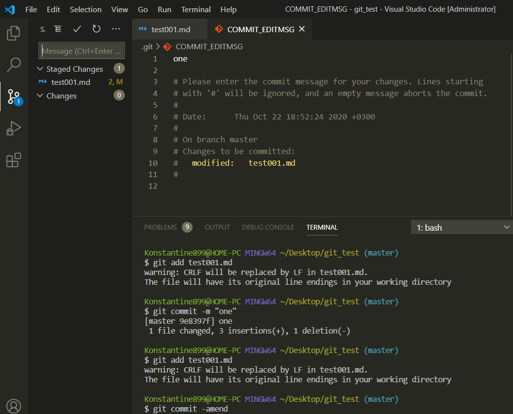
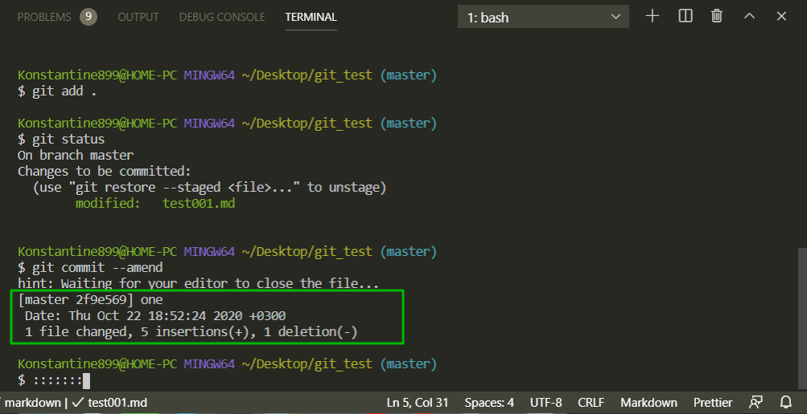

# Дополнительные способности git commit

**git commit -a -m "Сообщение коммита"** - Это будет тоже самое если вызвать две команды подряд **git add .** и после **git commit -m "Сообщение коммита"**. 

Параметр **-a**  был сделан для важего удобства. Ведь не придется набирать две команды для того что бы сделать коммит. А сразу произойдет добавление не отслеживаемых изменений в отслеживаемую зону и затем будет выполнен коммит.

Едиственное отличие от последовательного выполнения комманд и команды с параметром **-a**. Каманда с параметром **-a** не добавляет в отслеживаемую зону и соответсвенно в коммит новые или **untrucked** файлы. Эта команда добавляет только **modified** модифицированные файлы в отслеживаемую зону. 

Т.е. если мы создали новый файл, то он с помощь. этой команды не будет занесен в коммит. Что бы это сделать нужно поэтапное внесение команд **git add .** и после **git commit -m "Сообщение коммита"**.

Однако данная команда подойдет для файлов в которых произошла модификация.

Второй параметр который есть у команды **git commit** он называется **--amend**(изменить). Представим что вы сделали какой-то коммит и тут вы поняли что вы забыли добавить в этот коммит какие-то изменения. Вы не хотите создавать новый коммит для этих изменений. Вы хотите эти изменения поместить в этот последний коммит. Для этого вы можете использовать параметр **--amend**. Команда **git commit --amend -m "Новое сообщение коммита"** добавляет в него свежее изменение. И так же можно в случае надобности поменять сообщение последнего коммита, при этом новый коммит не создается. Переписывается последний коммит.

По практике нужно добавить изменения в отслеживаемую зону **git add .** и после применить или **git commit --amend** или **git commit --amend -m "Сообщение нового коммита"**.

Мы попадаем втекстовый редактор в котором говориться что если хотите что бы данные изменения применились просто закройте редактор. Для того что бы его закрыть нужно ввести знак двоеточие и wq **:wq**. Эта команда в текстовом редакторе vim выходит из редактора и сохраняет изменения. 

Однако на винде это не так. Мне пришдось просто закрыть файл **COMMIT_EDITMSG**.

Вот показано в какой коммит добавлено изменение. 

