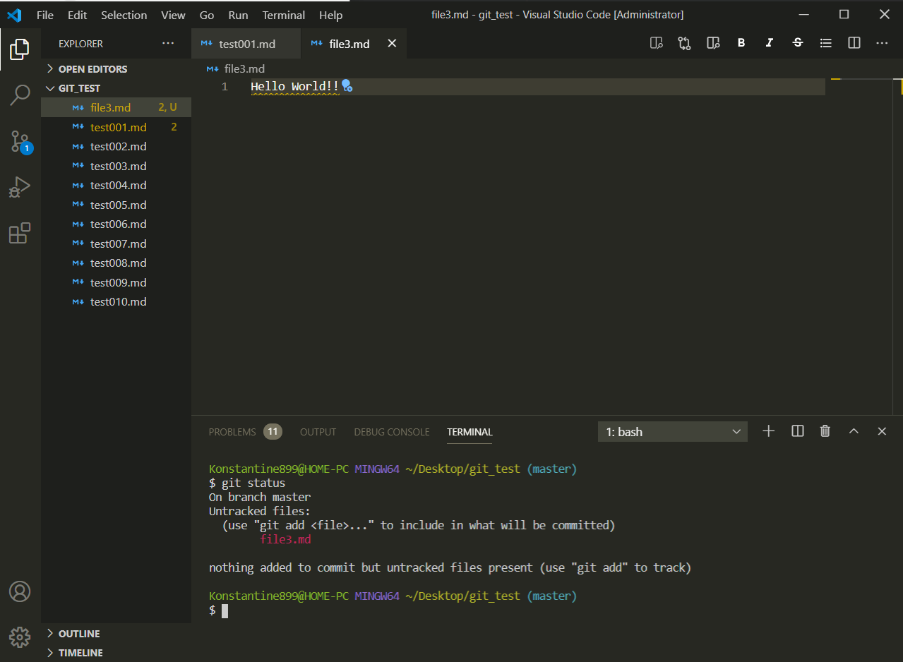
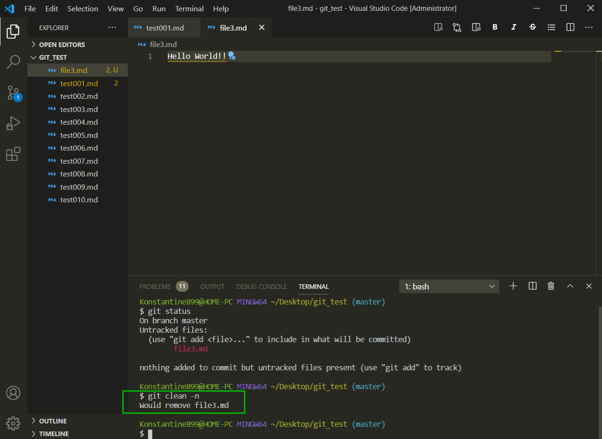
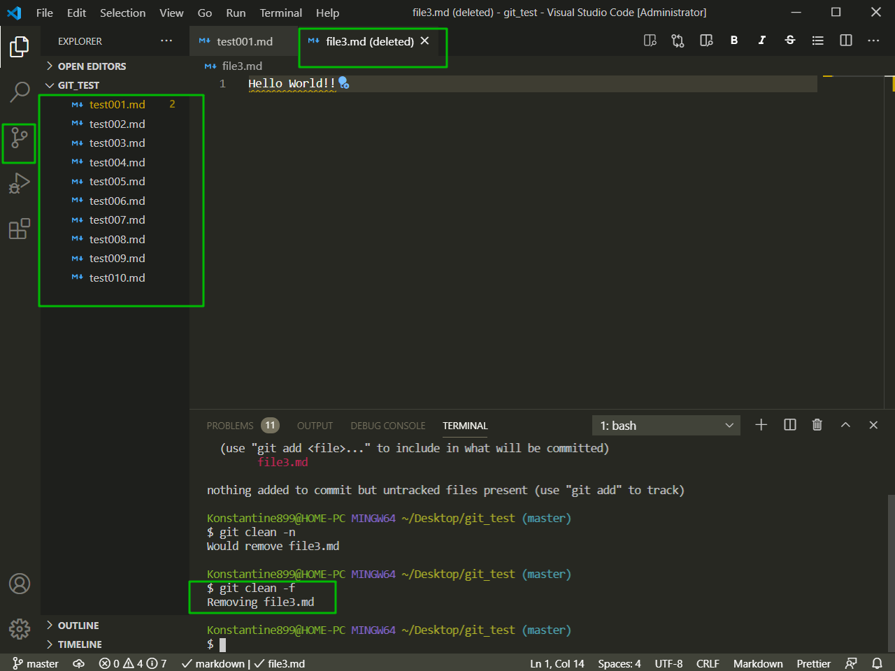

# 6. Команда git clean

Как вы уже знаете команда **git** reset позволяет убирать какие-то не жедательные изменения в нашем проекте и откатывать наш репозиторий к какому-то коммиту. Единственное что не может делать команда **git reset** это удалять **untraced**(не отслеживаемые) изменения.

Если мы например создадим в репозитории новый файл например **file3**

У нас есть не отслеживаемые изменения. Вот эти изменения команда **git reset** убрать не может. 
Когда мы добавляем новый файл, у нас изменения не **modified** т.е. не произошли изменения в репозитории, у нас появились новые файлы которые не отслеживаются. Именно такие файлы **git reset** не удаляет.

Если мы поняли что не правильно добавили файл и хотим вернуться к последнему коммиту мы конечно можем использовать самую сильную версию **git reset --hard HEAD**. Если мы это сделаем то сам файл все равно не удалиться потому что команда **git reset** не расспостраняется на **untraced** файлы.

Для этого существует команда git clean. Данная команда работает с новыми файлами которые были добавлены в репозиторий. Сначало мы вызываем данную команду с параметром **git clean -n**. Вызов с данным флагом **-n** покажет какие файлы будут удалены. При этом данный файл еще пока не удален

После того как мы убеждаемся что ничего лишнего удалено не будет мы вызываем данную команду с флагом **git clean -f** и произойдет удаление не отслеживаемых файлов.

