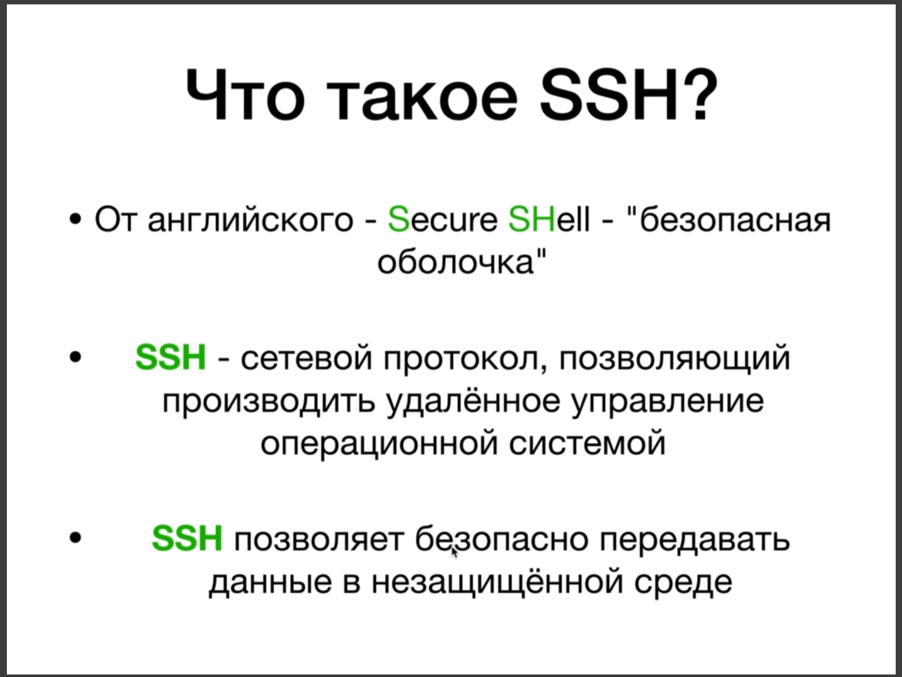

# Настройка SSH

Самая лучшая инструкция настройки shh. Проверка, есть ли у вас уже SSH ключ [https://docs.github.com/en/free-pro-team@latest/github/authenticating-to-github/checking-for-existing-ssh-keys](https://docs.github.com/en/free-pro-team@latest/github/authenticating-to-github/checking-for-existing-ssh-keys).

Генерация SSH ключа, если его нет [https://docs.github.com/en/free-pro-team@latest/github/authenticating-to-github/generating-a-new-ssh-key-and-adding-it-to-the-ssh-agent](https://docs.github.com/en/free-pro-team@latest/github/authenticating-to-github/generating-a-new-ssh-key-and-adding-it-to-the-ssh-agent)

Связка SSH ключа с вашим GitHub - аккаунтом [https://docs.github.com/en/free-pro-team@latest/github/authenticating-to-github/adding-a-new-ssh-key-to-your-github-account](https://docs.github.com/en/free-pro-team@latest/github/authenticating-to-github/adding-a-new-ssh-key-to-your-github-account)

После настройки я пробую через консоль удалить удаленный тестовый репозиторий. **git remote remove origin**. Если до этого работал без ssh то нужно связать репозиторий снова, толко ссылку выбирай во вкладке ssh.
