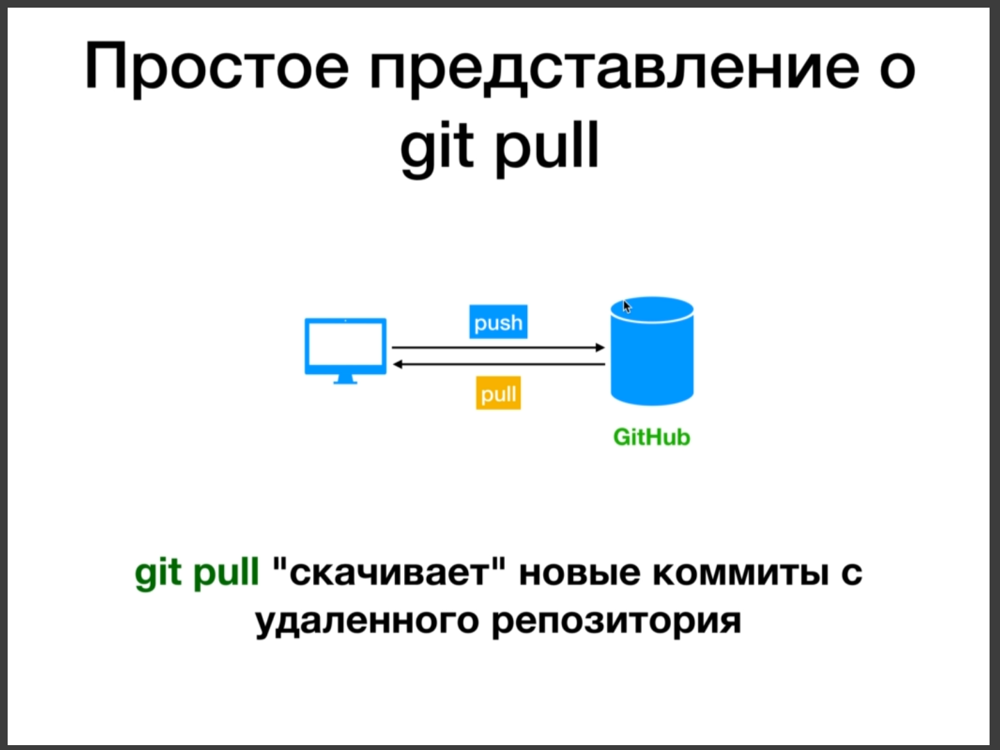
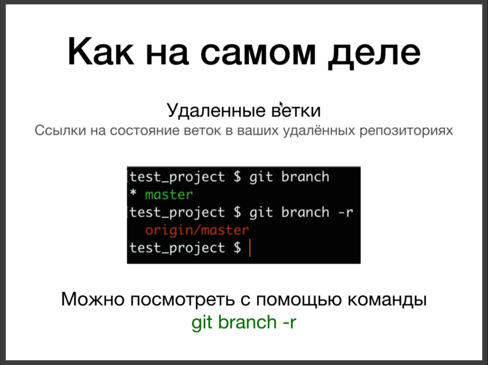
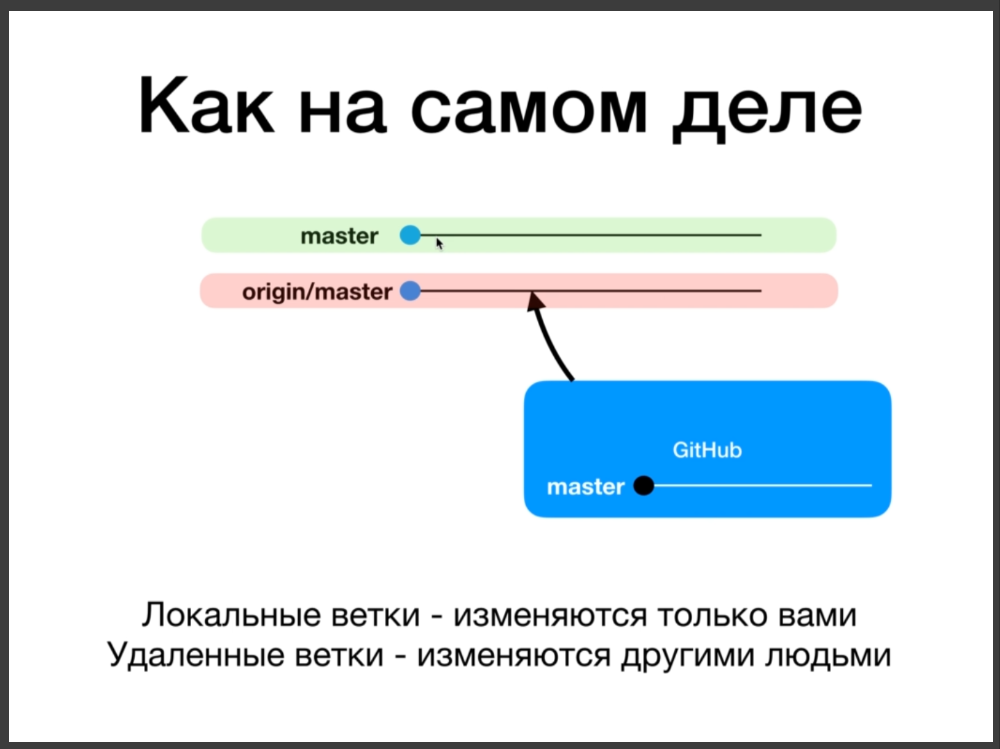
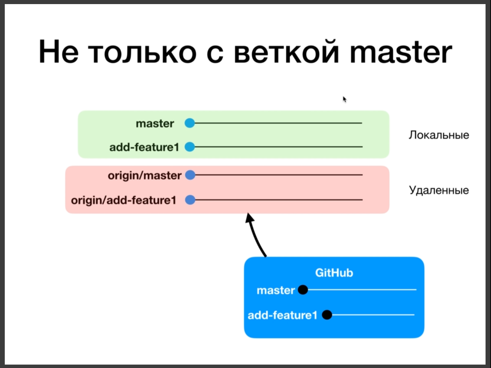
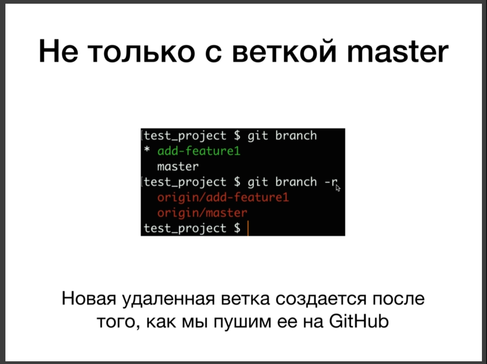
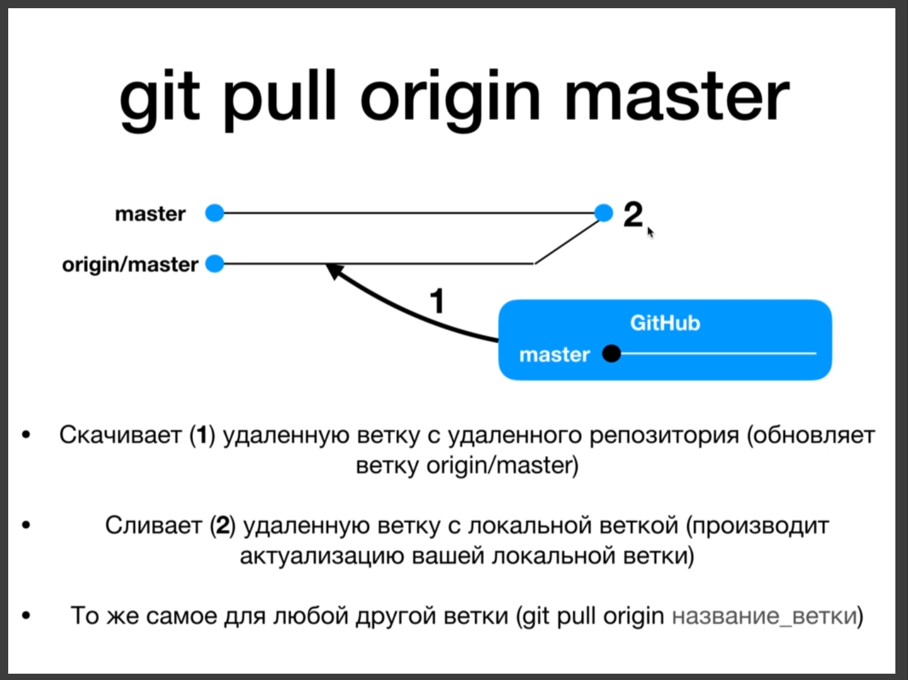

# Branching. Подробнее о команде git pull. Команда git fetch.

Ранее мы представляли git pull команда которая скачивает новые коммиты с удаленного репозитория.

На самом деле все немного не так.

Если мы вызовем git branch с флагом -r то мы получим список удаленных веток. На самом деле когда мы вызываем git branch мы получаем список локальных веток. А с помощью флага -r мы можем получить список удаленных веток.

На скрине приведен пример origin/master эта ветка указывает на ветку мастер на удаленном репозитории.

Команду git pull можно представлить как набор двух других команд.

1. git fetch - первый этам когда мы скачиваем удаленную ветку и просто обновляем нашу удаленную локальную ветку. На самом деле для этого мы можем использовать команду git fetch. НАдо строго понимать что origin/master это удаленная ветка, но она тоже у нас находится локально на кампьютере. Ветка master локальная и не как не связана с удаленным репозиторием. После того как git fetch находит удаленную ветку и скачивает после этого происходит слияние т.е. команда git merge origin/master.