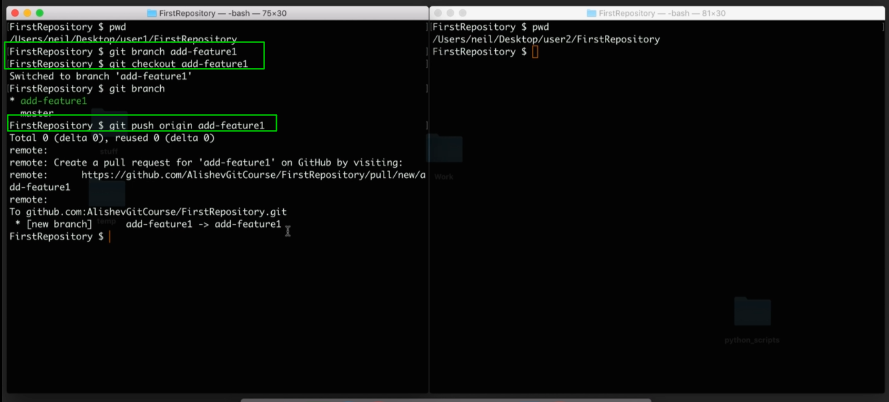

# Удаленные ветки подробно

Практика. Как и в предыдущих уроках мы работаем с двумя пользователями. У одного локальный репозиторий находится в **user1** и другого в **user2**.

Первый пользователь создает ветку **git branch add-feature1**. Он хочет добавить какую-то новую функцию в проект. Для этого он создал новую ветку. После чего он пушит эту ветку на удаленный репозиторий. Для этого делаю **git push origin add-feature1** теперь вместо названия главной ветки **master** пишу название той ветки которую добавляю на удаленный репозиторий.

Делаю изменения в **file1**, делаю коммит И пушу на удаленный репозиторий.

В мастере коммитов **14**, в новой ветке коммитов **15**, и можно посмотреть изменения.

Забыл сказать что после создания удаленной ветки я сделаю **git branch -r** то я увижу что удаленная ветка **origin/add-feature1** это ссылка на удаленную ветку которая находится на удаленном репозитории.

Теперь идем дальше. **user1** начал работу над своей функцией. Но предпольжим что для работы над этой функцией ему необходимо привлеч другого человека. И этот другой человек тоже будет работать в этой ветке.

для этого в репозитории второго пользователя мы сделаем **git pull**. Для этого мы могли бы воспользоваться командой** git pull origin add-feature1**, но мы можем сделать просто **git pull** и тем самым скачать все возможные ветки с удаленного репозитория.

Теперь если я сделаю **git branch** то я увижу что у второго пользователя как была одна ветка **master** так и осталась.

Если я сделаю **git branch -r** то я увижу что ссылка на удаленные репозиторий данной ветки присутствует.

Но данная ветка пока что только удаленная. Нам нужно как-то интегрировать данную ветку в наш локальный репозиторий. Для этого я могу сделать **git checkout add-feature1** т.е. мы перемещаемся в эту ветку таким образом как будто мы создалии ее на локальном репозитории. На самом деле мы просто спулили эту веткус удаленного репозитория и она у нас находится только в этом виде **origin/add-feature1**. Но что бы эту ветку интегрировать в наш локальный репозиторий, что бы помимо удаленной ветки у нас еще была и локальная ветка, мы делаем **git checkout** и переходим в эту ветку. Мы видим что после этой команды наша созданная локальная ветка **add-feature1** она теперь настроена на то что бы синхронизироваться с удаленной веткой **add-feature1** которая у нас пришла от **origin** т.е. от удаленного репозитория. И так же мы переключились на эту ветку.

Теперь когда мы будем делать **pull** или **push** в этой ветке мы будем связываться с той удаленной веткой.

В **Git** есть одна полезная команда которая связана с удаленными ветками. Она называется **git remote show** и названия удаленного репозитория, в нашем случае **origin**. С помощью этой команды **git remote show origin** мы можем видить информацию о ветках внашем проекте.

Здесь мы сначало видим удаленные ветки. Далее я вижу список локальных веток.

И так же я вижу то на сколько наши ветки находятся в актуальном состоянии.

т.е. если на **GitHub** какая - то ветка будет изменена, если эти изменения мы не добавим в наш локальный репозиторий. Т.е. здесь мы можем увидить что наша ветка не совсем в актуальном изменении. Т.е. данная команда связывается с удаленным репозиторием и смотрит находятся ли наши локальные ветки в соответствии с удаленными ветками.

Теперь предположим что первый пользователь больше не захотел разрабатывать функцию и захотел удалить все изменения которые были созданы в этой ветке. Для начало **user1** захочет удалить удаленную ветку. Для того что бы удалить удаленную ветку он делает команду **git push** с флагом **--delete** после указываю название удаленного репозитория **origin** и название нашей ветки **add-feature1** т.е. вот такая команда **git push --delete origin add-feature1**. Так у себя в репозитории я удалил ветку **main**.

Теперь когда **user1** удалил данную ветку с удаленного репозитория, он наверняка захочит удалить данную ветку с локального репозитория. Для этого мы сначало должны выйти с данной ветки и перейти в ветку например **master**. И теперь удаляю локальную ветку **git branch -d add-feature1**. И мы видим что **git** выдает нам ошибку.

он не может удалить эту ветку потому что она не была слита в какую либо из других веток. Т.е. в этой ветке **add-feature1** было какое-то изменение, был какой-то коммит и этот коммит мы не **merge** не слили не в одну из других веток. И если в этом коммите содержаться какие-товажные изменения, то при удалении этой ветки этот коммит и эти изменения будут потеряны.

Но здесь так же написано что если мы уверены что мы хотим удалить эту ветку g**it branch -D add-feature1**. С помощью флага **-D** мы подтверждаем удаление.

И в завершении давайте разберем одну проблему которая может возникнуть в случае удаления удаленной ветки.

После чего первый пользователь удалил ветку.

Что же теперь будет у **user2** у которого данная ветка присутствует.

Поблема в том что ветки **add-feature1** больше нет так как она была удалена первым пользователем. Если **user2** сделает **push** этой ветки на удаленный репозиторий, то просто будет создана новая удаленная ветка на **GitHub**, только создателем будет **user2**. Кароче по до говоренности **user2** должен удалить эту ветку локально с флагом **-D**.