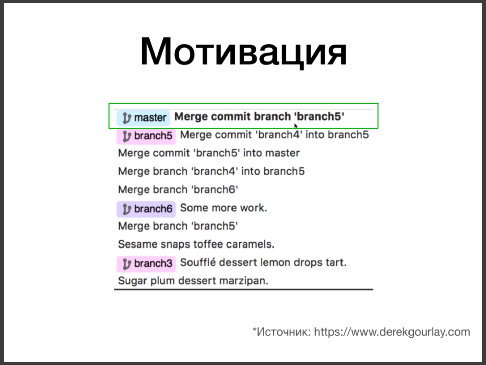
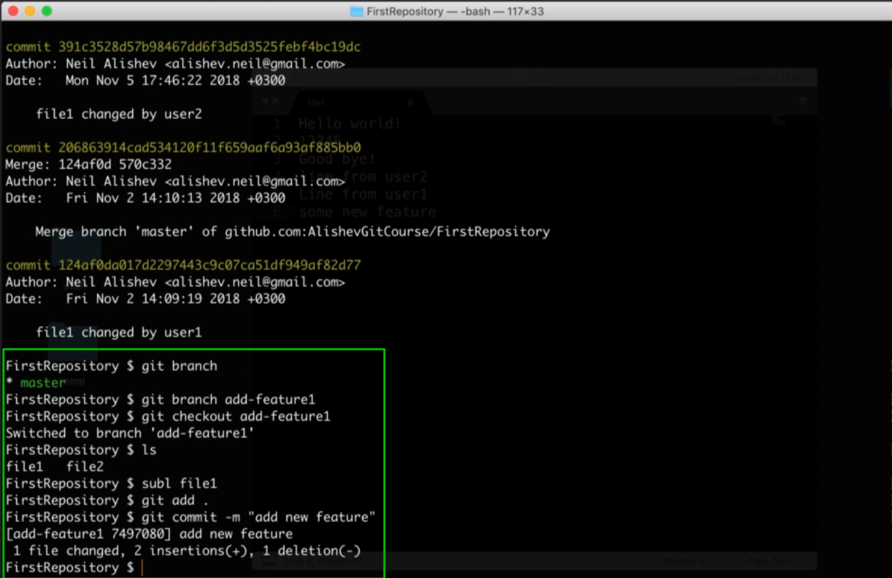

# Продвинутые темы git rebase(перебазирование).

Давайте разберемся для чего это было придумано.

Из уроков про слияние мы помним что у нас есть **Fast Forward** слияние и не Fast Forward слияние. 

Дело в том что в больших проектах, в проектах с множеством ветвей вот этих коммитов слияния может быть очень много.

Как мы видим из скриншота проекта самих коммитов меньшинство. Большинство коммитов слияния. Многие люди считают что коммиты слияния засоряют нашу история коммитов. Коммиты слияния не несут смысловой нагрузки. 

Поэтому была придумана команда **rebase**.

Эта команда тоже производит слияние веток, но при этом она не создает коммитов слияния которые по мнению некоторых людей засоряют историю коммитов.

Различия команды **rebase** и **merge**

Как работает **rebase**?

На скришоте видно что нужно перейти в отпачкованную ветку и сделать команду **git rebase master**. Происходит перенаправление на последний **HEAD** коммит и уже от него происходит отпочкование ветки. Т.е. мы перенесли ветку и сделали так что как буд-то бы она была создана на последнем **HEAD** коммите. Теперь если я солью ветки **add-feature1** и **master** то произойдет **Fast Forward** слияние т.е. без создания коммита слияния.

Как это работает?

для того что бы совершить данную команду **rebase** у нее есть так называемая временная зона.

В эту временную зону помещаются те коммиты которые есть в самой ветке. Например если мы находимся в ветке **add-feature1** и хотим сделать **git rebase master** это значит что мы хотим добавить все коммиты из **master** в нашу ветку **add-feature1** и поверх этих коммитов уже накатить коммиты из самой ветки **add-feature1**.

И для этого **git rebase** берет эти коммиты и удаляет их из нашей ветки и переносит их во временную зону т.е. теперь в нашей ветке **add-feature1** нет коммитов, они перешли во временную зону. И затем после этого команда rebase она добавляет коммит №4 из ветки master, она добавляет его в ветку **add-feature1**. Далее берет коммиты из временной зоны, и поверх коммитов из ветки **master**, добавляет по одному коммиту в ветку **add-feature1**.

Можно ли сделать **rebase** наоборот?

Здесь наоборот мы сначало переходим в ветку **git checkout master**. И находясь в ветке **master** мы вызываем команду **get rebase add-feature1**. Мы переносим наш коммит №4 во временную зону. Далее переносим коммиты из ветки **add-feature1** в ветку **master** по одному. После того как перенесутся коммиты происходит обращение к временной зоне мы переносим коммит #4 в ветку **master**. И в итоге получается линейная структура без **merge** коммитов.

При выполнении команды **rebase** могут возникать конфликты слияния.

После того как мы разрешим конфликт вручную мы можем продолжить слияние с помощью **git rebase --continue**. Или же если мы больше не хотим сливать жти две ветки мы можем сделать **git rebase --abort**.

Практика.

В этой практике у нас будет три отдельных сценария.

В первом у нас пользователь будет работать локально над своим репозиторием. Я склонировал репозиторий с **GitHub** у нас вот такая история коммитов.

И в этом репозитории одна ветка **master**. теперь предположим что мы хотим создать какую-то новую функцию. Для этого я создаю отдельную ветку **git branch add-feature1** и перехожу в ее **checkout add feture1**. В этой ветке я что-то изменяю и делаю коммит.

Предположим что в ветке мастер случился баг. Мы переходим туда и что-то фиксим. После чего делаю новый коммит.

Мы в ветке **master** сделали коммит. И у нас образовалась такая ситуация что в ветке **add-feature1** есть коммит и в ветке **master** тоже есть **commit**. И если я сделаю **git merge add-feature1**, то у нас конечно же будет создан **merge** коммит или коммит слияния. Потому что в таких условиях не возможно провести **Fast Forward** слияние. Но с помощью команды **git rebase** мы сможем провести **fast forward** слияние. 

Для этого перехожу в ветру **add-feature1**. Сейчас находясь в ветке **add-feature1** мы можем сделать **git rebase master**. Что же произойдет? Когда мы сделаем **git rebase master** коммит из ветки **master**, который исправляет критический баг, он будет перенесен в ветку **add-feature1**. Таким образом ветка **add-feature1** перебазируется и после чего я смогу сделать наш **fast-forward merge**.

так же в принципе мы моглибы сделать наоборот. Если мы переключимся на ветку **master**. Cделать **git rebase add-feature1**. И в этом случае у нас произошло бы наоборот. У нас бы коммит который исправляет критический баг был бы перенесен во временную зону, удален из истории коммитов ветки **master**. Далее был бы взят коммит из ветки **add-feature1** который добавляет новую функцию, он бы был применен к нашей ветке master и после того как все коммиты из ветки **add-feature1** были бы применены к ветке **master**, после этого коммит из временной зоны был бы применен поверх к нашей ветке **master**.

Сделаю к примеру первый вариант.

**Кароче если будеь работать в команде разбери далее эти сценарии.**