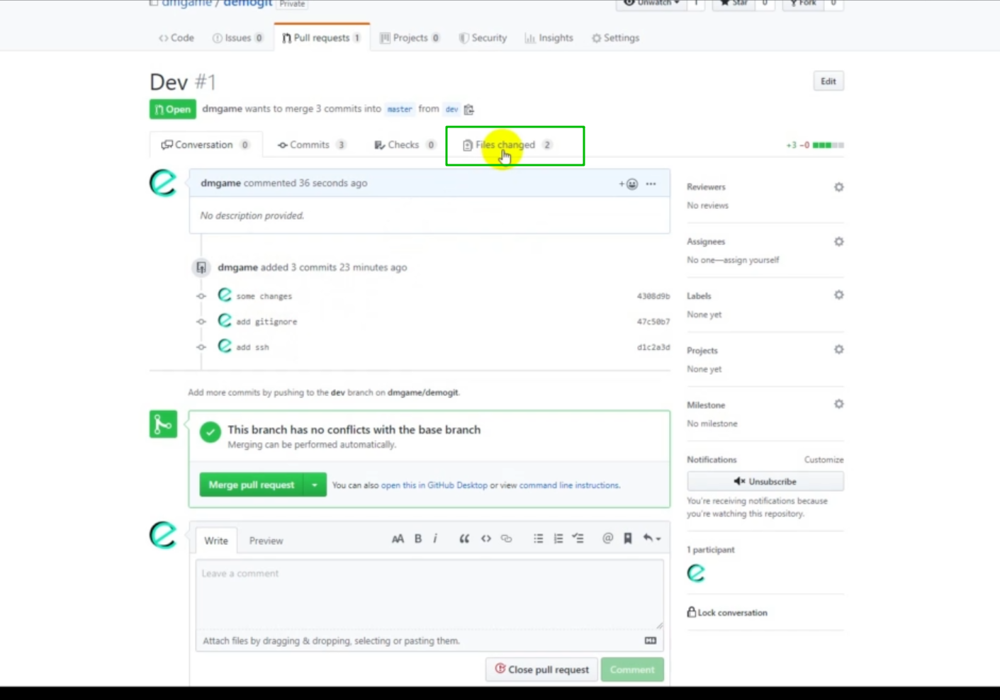

# git flow and pull requset.md

Смотрим как это работает. Есть две ветки **dev** и **master**.

И можем прямо отсюда нажать **New pull request**.

Далее мы выбираем из какой ветки и в какую т.е я говорю из **compare:dev** хотим залить изменения в **base:master**. Так же здесь я могу написать какие-то комментарии о том что мы сделали.

И далее я нажимаю **create pull request**. Сверху пишется **Able to** merge это значит что не будет ошибок при совмещении веток. Однако ошибки тоже могут быть но **pull request** все равно создастся.

Создан **pull request**, изменения еще не попали в мастер.

Мы видим какие были коммиты в этой ветке.

Мы можем посмотреть какие файлы были изменены.

Я могу прямо здесь комментировать любую строку кода.

т.е. я могу сказать что здесь что то не так.

Пишется это в **markdown**.
Комментариев может быть множество.

Перехожу назад в **Conversation**

Здесь мне предлагается засабмитить **review** потому что я как бы начал комментировать этот код. Другой человек может ответить на комментарий. Или же сделать **Resolve conversation**(Разрешить разговор) если проблема была решена.

Далее если ошибок нет я могу **merge** ветки

После я могу удалить ветку

Она удалиться только на удаленном репозитории на локальном она остается.
