# Работа с удаленным репозиторием

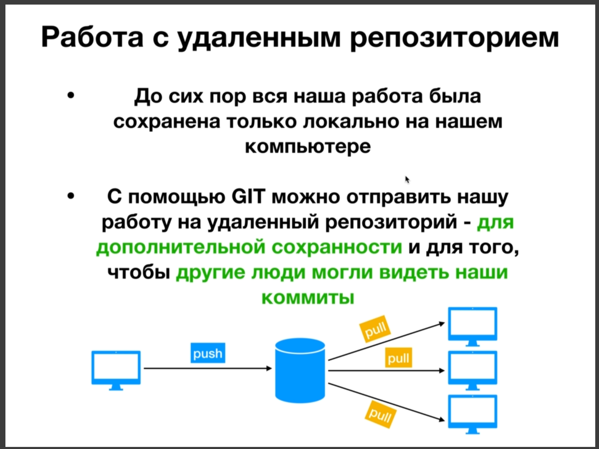

В начале рассказывает про регистрацию на **GitHub**

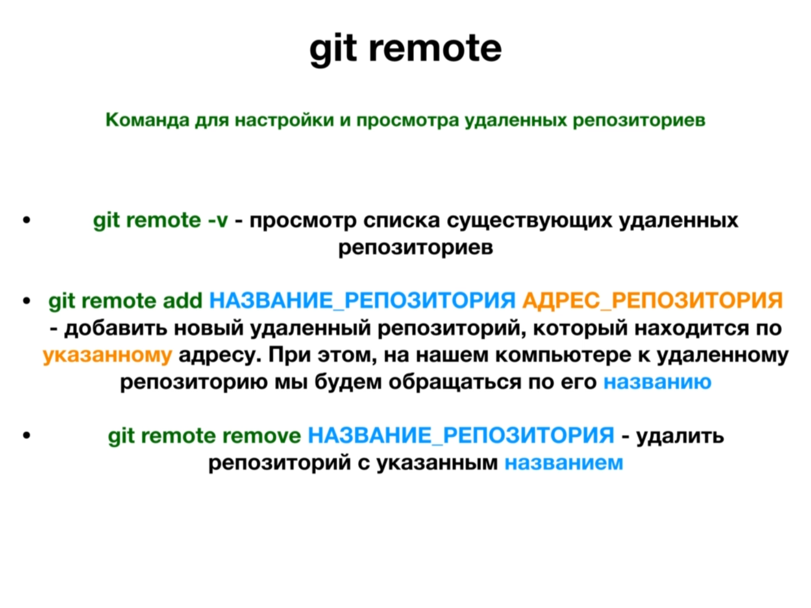

Когда мы добавляем репозиторий с помощью команды **git remote**(удаленный) мы делаем такую закладку которая связывает название репозитория который мы ему зададим и адрес этого репозитория. И **git** будет знать что можно обращаться по такому названию и по такому адресу к удаленному репозиторию.

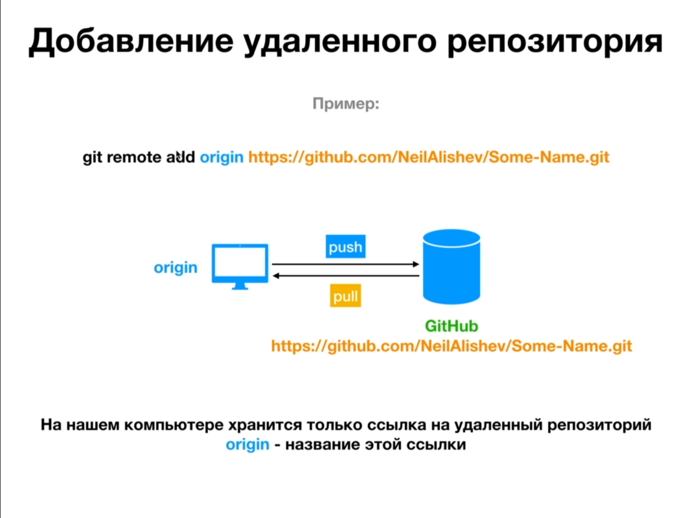

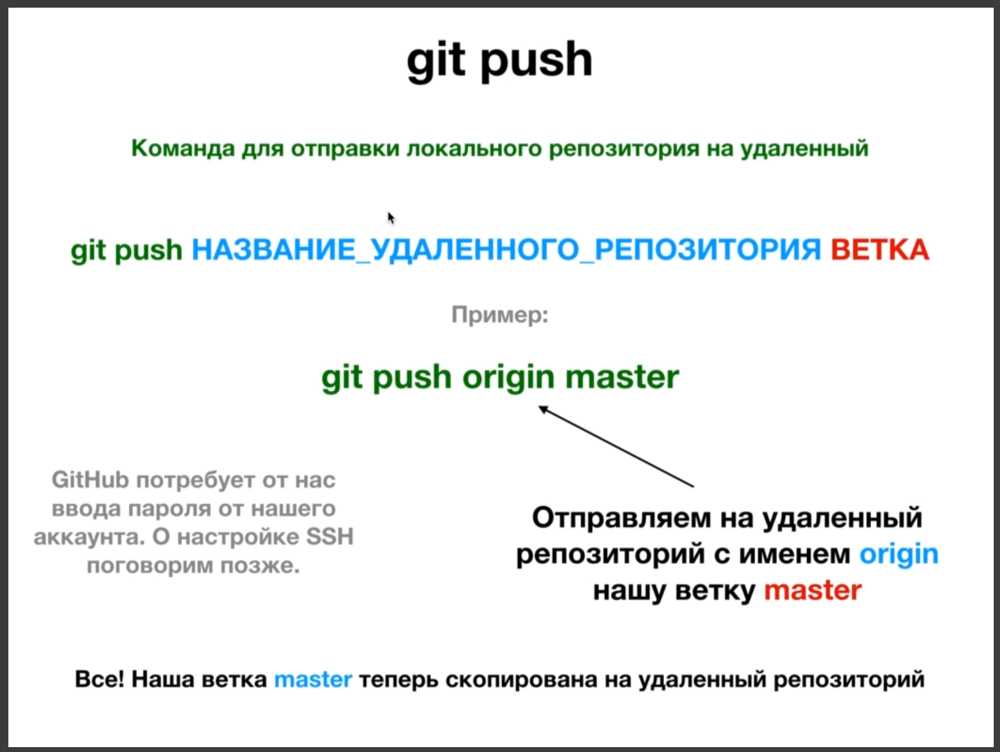

**git push** эта команда необходима для отправки локального репозитория на удаленный.

Команда которая необходима для получения репозитория называется **git pull**

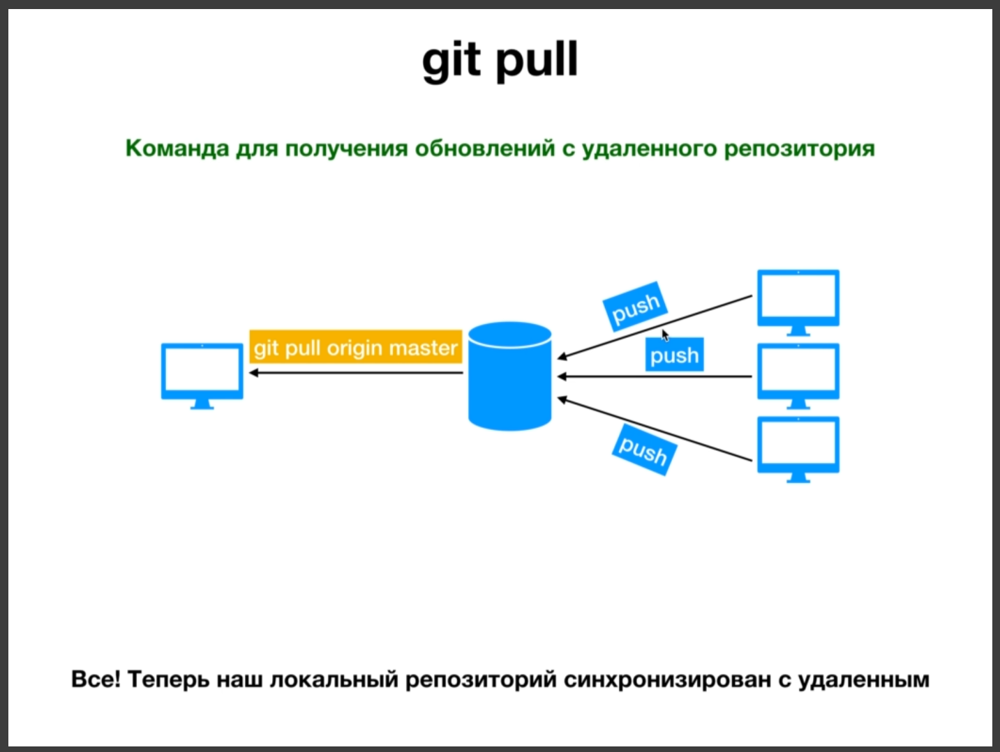

C помощью команды **git pull origin master** мы сможем вытаскивать изменения из удаленного репозитория который находится в ветке **master**.

Так же у нас может существовать несколько удаленных репозиториев. С помощью команды **git remote add** мы можем задать имена репозиториям и они будут находится по разным адресам.

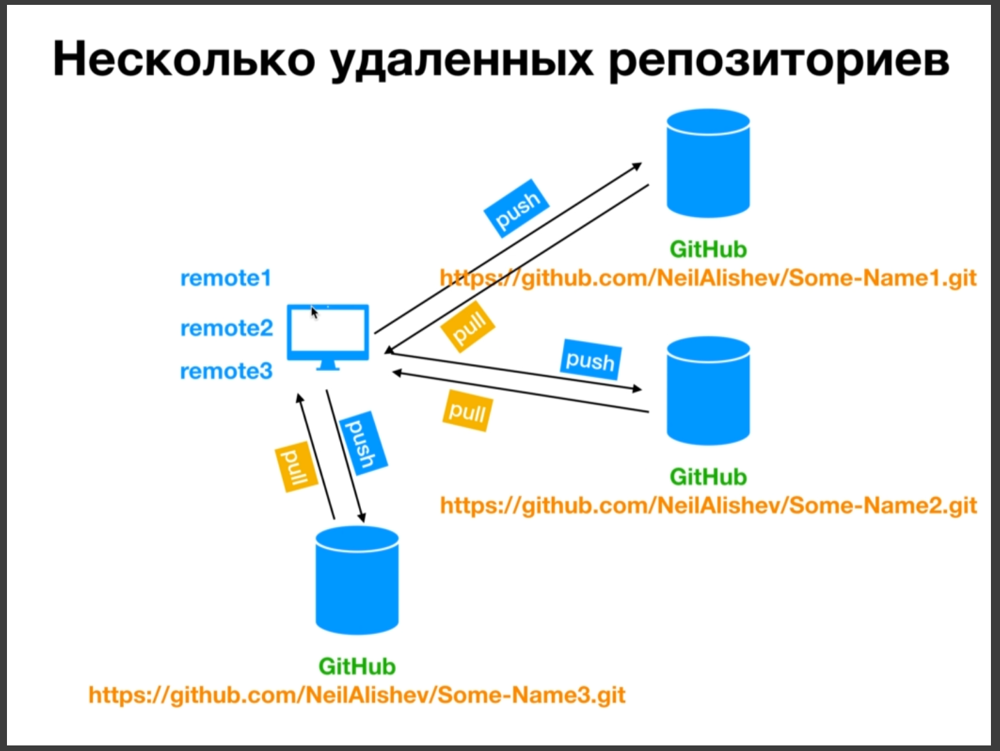

И так попрактикую с тестовым репозиторием. Создаю удаленный репозиторий на **GitHub**. После чего данные репозитории необходимо привязать друг к другу. Удаленный репозиторий называею **test_repository**. После создания удаленного репозитория я вижу присвоенный ему адрес.

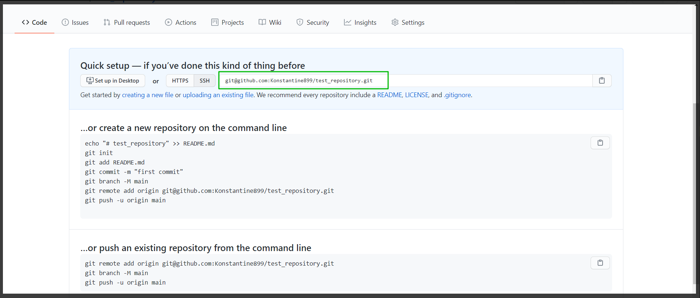

Копируем этот адрес. Привязываю локальный репозиторий к удаленному.

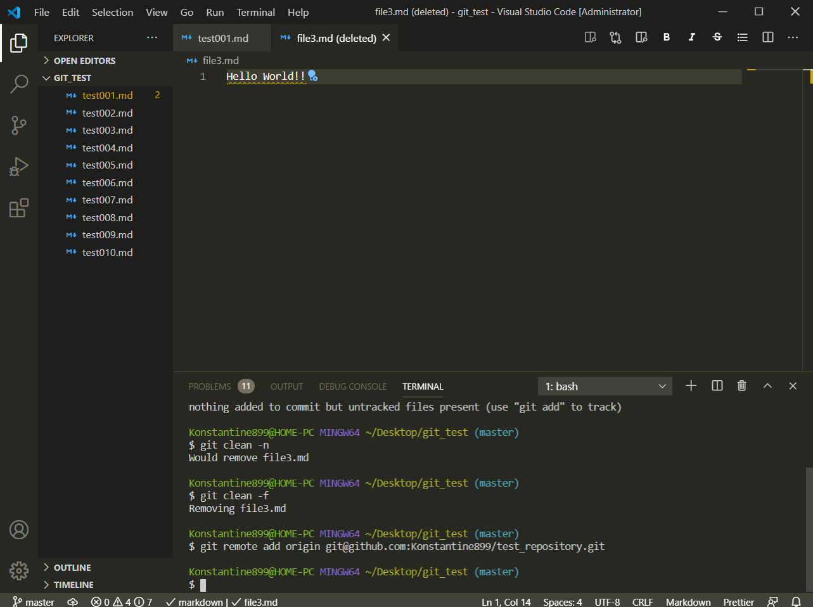

И далее с помощью команды **git remote -v** смотрю былали привязка осуществлена успешно.

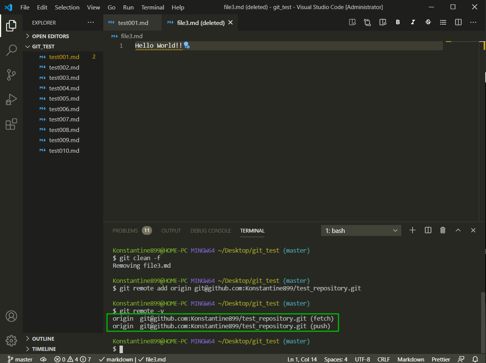

Смотрим что он у нас добавился. Данный репозиторий и для **fetch** и для **push**. **Fetch** у нас практически тоже сомое что и **pull**. Разницу попозже узнаем.

Теперь мы можем запушить наш локальный репозиторий на удаленный. **git push origin master** где origin - название репозитория который мы задавали, а **master** главная ветка и так же это едиственна ветка в которой мы работали на локальном репозитории. При добавлении локального репозитория у него запросил имя репозитория и пароль, у меня же подтверждение ssh.

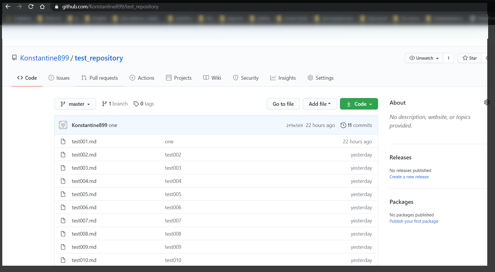

И история коммитов.

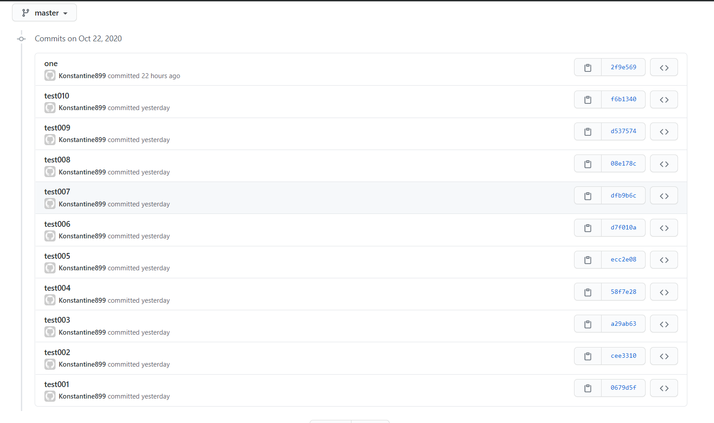

Теперь я удаляю локальный тестовый репозиторий и создаю новый репозиторий. Перехожу **cd** указываю путь где создаю папку, далее с помощью команды **mkdir** создаю папку. Далее инициализирую проект **git init**. Далее связываю с удаленным репозиторием вот ссылка на репозиторий

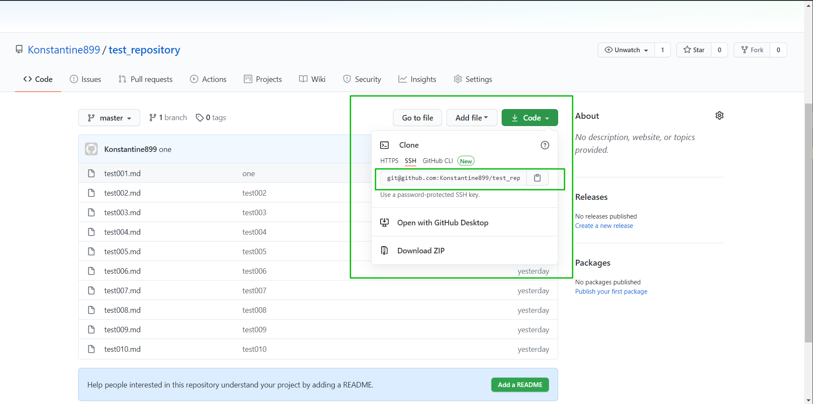

c помощь. команды **git remote add origin git@github.com:Konstantine899/test_repository.git** связываю локальный и даленный репозиторий. После делаю проверку **git remote -v**. После чего скачиваю удаленный репозиторий **git pull origin master**. И вот мой репозиторий мнова на компе.
